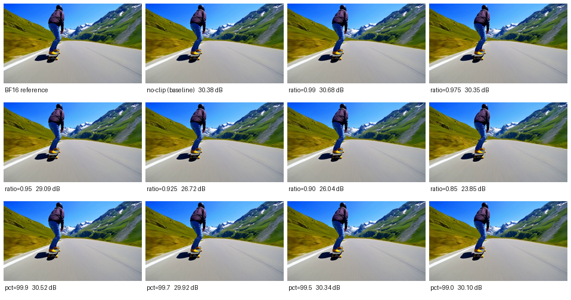
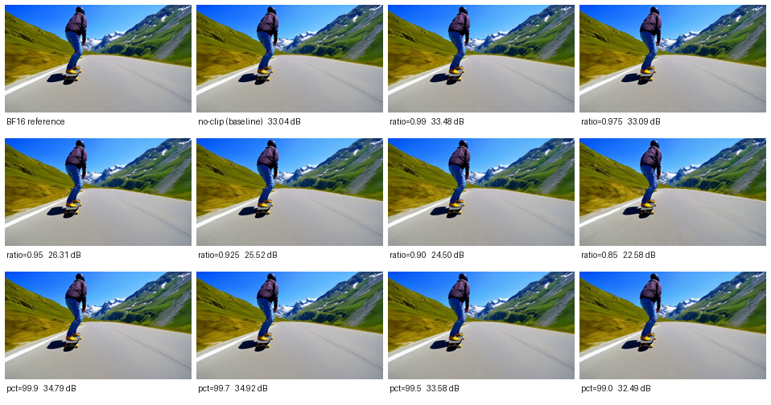

# Report 2026-07-13：首帧口径下的全方法量化对比

> 协议：**首个生成帧 PSNR**——LongCat seg1 输出的帧索引 93（93 帧共享初始视频之后的第一个新生成帧），量化 run vs BF16 run，同 prompt（滑板手, prompt_idx=1）/同 seed(0)/同评测器。该口径测的是"量化误差刚注入注意力、未被自回归混沌放大"的纯净信号，也是与 paper Table 1 数字吻合的口径（见 [REPORT.md](../backup/REPORT.md) §一.3）。
> QuaRot 为本项目移植（官方无发布实现，`quarot_quant.py`：Hadamard 旋转 + 分块 RTN，无 clip，等价官方默认 clip_ratio=1.0）；RTN 为仓库自带 `naive-int*`；QVG/QVG-Pro 为论文原方法。

## 总表（LongCat，frame 93，dB）

INT2 各方法为 **3 次独立运行的 mean ± std**（详见下方方差实验一节）；INT4 除 QVG 外为单次测量（QuaRot/RTN 为确定性算法，单次即精确值，σ≤0.003 已在 INT2 侧验证）。

| 位宽 | 方法/变体 | 本地实测 (mean ± std, n=3) | Paper Table 1 | 名义压缩率 | 备注 |
|---|---|---:|---:|---:|---|
| **INT2** | QVG-Pro（S=4, B=16） | **31.04 ± 0.005** | 30.376 | 4.97× | 全场最高 |
| | QVG（发布版） | 28.88 ± 0.18 | 28.716 | 6.89× | 方差源于质心 atomic_add；另 rngiso 变体单次 29.34 |
| | **QuaRot 非对称 B16 + clip(ratio=0.99)** | **30.68**（n=1，确定性） | — | 6.40× | 本日新增，超无 clip 基线 +0.30 |
| | QuaRot 非对称 B16 | **30.38 ± 0.003** | 21.573 | 6.40× | ⚠️ 高出 paper 的 QuaRot 8.8 dB |
| | QuaRot 对称 B16 | 21.42 ± 0.000 | (21.573) | 6.40× | 与 paper 的 QuaRot 值吻合 |
| | QuaRot 非对称 B128 | 24.54 ± 0.002 | — | ~7.3× | |
| | RTN B16 | 21.85 ± 0.001 | 20.872 | 6.40× | |
| **INT4** | QVG-Pro | —（未测） | 37.095 | 3.05× | |
| | QVG | 34.36 ± 1.28（n=3） | 37.141 | 3.72× | 三次异构测量（发布版/rngiso/对照臂），长尾波动大 |
| | **QuaRot 非对称 B16 + clip(pct=99.7)** | **34.92**（n=1，确定性） | — | 3.55× | 本日新增，超无 clip 基线 +1.88；⚠️ 张量级 MSE 反向，待多 prompt 复验 |
| | QuaRot 非对称 B16 | 33.04（n=1，确定性） | 33.744 | 3.55× | |
| | QuaRot 对称 B16 | 34.01（n=1，确定性） | (33.744) | 3.55× | |
| | QuaRot 非对称 B128 | 30.72（n=1，确定性） | — | | |
| | RTN B16 | **35.23**（n=1，确定性） | 32.984 | 3.55× | INT4 最高 |

## 三个读数

1. **INT2：标准非对称 QuaRot 是被 paper 严重低估的强基线**（本地 30.38 vs paper 声称 21.57），在首帧口径下略胜 QVG（28.7~29.3）约 1~1.7 dB，压缩率相近（6.40× vs 6.89×）。paper 的 QuaRot 数字只与**对称量化**变体吻合（21.42）——作者的私有移植大概率用了对称量化。"QVG 显著优于 QuaRot"这一 Table 1 的核心对比仅在该弱化版基线下成立。
2. **INT4：全部方法挤在 33-35 dB 窄带**，方法间排序被 QVG 自身 ±2.3 dB 的运行间波动（k-means 质心 atomic_add 非确定性）淹没；确定性方法中 RTN B16（35.23）最高——15 个量化等级 + 细粒度 scale 已足够，旋转与聚类均不再提供优势。
3. **QVG 无争议的优势档位是 QVG-Pro**（31.03，INT2 最高），但其压缩率也最低（4.97×）。

## QuaRot + 旋转后裁剪扫描（本日实验）

**假设**：原始 KV 上裁剪是灾难（[CLIP_STUDY.md](../backup/CLIP_STUDY.md)），但 Hadamard 把单点信息摊到全部坐标、分布高斯化之后，轻度裁剪应从"灾难"翻转为"小赚"。
**设计**：底座 = QuaRot 非对称 B16；(b) 主实验 = 逐块范围收缩（`scale = 块内 min/max × ratio`，QuaRot 官方语义）；(a) 对照 = 旋转后全局分位硬夹（与原始 KV 实验同口径）。20 条 run，全部经独立验证 agent 复核。

**(b) 逐块 ratio 收缩**（无 clip 基线：INT2 = 30.38 / INT4 = 33.04）：

| ratio | 0.85 | 0.90 | 0.925 | 0.95 | 0.975 | **0.99** | 1.0(基线) |
|---|---|---|---|---|---|---|---|
| INT2 | 23.85 | 26.04 | 26.72 | 29.09 | 30.35 | **30.68** | 30.38 |
| INT4 | 22.58 | 24.50 | 25.52 | 26.31 | 33.09 | **33.48** | 33.04 |

**(a) 旋转后全局分位夹**：

| pct | 99.0 | 99.5 | 99.7 | 99.9 |
|---|---|---|---|---|
| INT2 | 30.10 | 30.34 | 29.92 | 30.52 |
| INT4 | 32.49 | 33.58 | **34.92** | 34.79 |

**读数**：
1. **假设方向获证实但幅度有限**：旋转后最温和的收缩（ratio=0.99）在两个位宽上都小幅超越无 clip 基线（INT2 +0.30 → 30.68；INT4 +0.44 → 33.48），存在真实的内部最优点——与原始 KV 上"裁剪单调有害"形成机制性对照。
2. **意外亮点：INT4 的旋转后全局分位夹有明显内部最优**——p99.7 → **34.92（+1.88）**，逼近确定性方法冠军 RTN B16（35.23）。INT2 的分位对照组则围着基线持平（±0.3，噪声级）：位宽越高（自身量化误差越小），削掉旋转后的虚高尾部收益越大。
3. **深裁仍有害但损伤模式质变**：ratio≤0.95 单调受损（INT4 在 0.95→0.975 之间有 ~6.8 dB 断崖），但对比原始 KV 裁剪的"主体变幽灵"，旋转后即使裁到 0.85（23.85）**画面主体完好**、只有弥散性细节漂移——首帧对比图（`first_frames/_contact_sheet_int{2,4}_qclip.png`）直观呈现了"旋转保护单点信息"的效应。
4. INT2 新最优（QuaRot+clip 30.68）与 QVG-Pro（31.03）只差 0.35 dB，而压缩率更高（6.40× vs 4.97×）——**"旋转+轻裁"在压缩-质量权衡上已与论文最强档位可比**。

## INT2 方差实验（每方法 3 次独立运行）

每个方法用完全相同的配置在不同集群节点上独立跑 3 次，量运行间方差：

| 方法 | run 1 | run 2 | run 3 | mean ± std | 方差来源判定 |
|---|---:|---:|---:|---|---|
| QVG-Pro（S=4, B=16, rngiso） | 31.031 | 31.042 | 31.038 | **31.04 ± 0.005** | 质心 atomic_add（被 4 阶段平均稀释） |
| QVG（发布版 S=1, B=64） | 28.718 | 29.130 | 28.805 | **28.88 ± 0.18** | 质心 atomic_add（单阶段，无稀释） |
| QuaRot 非对称 B16 | 30.377 | 30.382 | 30.383 | **30.38 ± 0.003** | ≈0（确定性算法） |
| QuaRot 对称 B16 | 21.415 | 21.415 | 21.415 | **21.42 ± 0.000** | ≈0（确定性算法） |
| QuaRot 非对称 B128 | 24.546 | 24.542 | 24.546 | **24.54 ± 0.002** | ≈0（确定性算法） |
| RTN B16 | 21.847 | 21.849 | 21.850 | **21.85 ± 0.001** | ≈0（确定性算法） |

**读数**：
1. **预注册的预测完全命中**：无随机源的方法（QuaRot×3、RTN）三次运行几乎逐位一致（σ ≤ 0.003 dB，纯评测/编码噪声）——证明测量管线自身零噪声，所有方差都来自方法本身。
2. **QVG 的 σ = 0.18 dB（3 样本）**：源于 k-means 质心更新的 `atomic_add` 浮点累加顺序竞争（种子固定也无法消除）。此前跨批次观测到的更大偏差（如 INT4 的 33.5 vs 35.8）表明长尾波动可达 ±1-2 dB——3 样本的 std 可能低估尾部。
3. **QVG-Pro 意外地极稳（σ = 0.005）**：4 阶段渐进残差把单阶段质心噪声平均掉了——精度和稳定性双赢，只是压缩率最低。
4. 方法排序在方差意义下的结论：INT2 首帧口径，**QVG-Pro (31.04) > QuaRot+clip0.99 (30.68) > QuaRot 非对称 (30.38) > QVG (28.88±0.18)** ——前三名之间的差距均远大于测量噪声，排序稳健。

### Clip 的张量级刨析：最大值降幅与 MSE 分解

在真实视频 KV（Self-Forcing layer 15，35,880 token；注意：视频实验为 LongCat，此处为同类数据的代表性测量）上量化 clip 的两个基本问题：

**① 最大值从多少降到多少：**

| | 原始 max\|x\| | 旋转后 max | p99.7 阈值 | p99.9 阈值 | 块级(16值) max 中位数 |
|---|---:|---:|---:|---:|---:|
| K | 18.00 | **9.52**（Hadamard 自身已砍半） | 4.70 | 5.35 | 2.83 |
| V | 9.38 | 11.02（V 无尖峰通道，旋转后微升） | 3.65 | 4.11 | 2.31 |

全局 p99.7 把天花板再砍半（9.5→4.7）；ratio 0.99 只收各块自身 max 的 1%（块级中位数才 2.8）——两种 clip 力度差一个量级。

**② 重构 MSE（含被裁值误差，vs 无 clip 基线）：**

| | ratio 0.99 | p99.7 | p99.9 |
|---|---:|---:|---:|
| INT2 | **−2.2%** | −0.9% | −0.3% |
| INT4 | **−1.3%** | **+19.7%** | +5.9% |

**③ MSE 分解（p99.7，被裁 0.30% 的元素 vs 幸存 99.7%）**——回答"净 MSE 为何 INT2 降 INT4 升"：

| | 幸存值 MSE 改善 | 被裁值单元素 MSE | 被裁值占净 MSE 比重 |
|---|---:|---:|---:|
| K INT2 | +1.7% | 0.648 | **0.9%**（淹没在量化噪声里） |
| K INT4 | +1.7% | 0.648 | **18.0%**（量化噪声太小，削顶误差凸显） |
| V INT2 | +1.5% | 0.354 | 0.7% |
| V INT4 | +1.5% | 0.354 | 16.0% |

结构一目了然：**scale 收紧给幸存值的收益是恒定的 ~1.6%，削顶给被裁值的损失也是恒定的绝对量——净效应的正负完全取决于量化噪声地板的高低**。INT2 地板高，削顶损失隐身（净 −0.9%）；INT4 地板低，削顶损失占净误差 16-18%（净 +19.7%）。

**④ 一个诚实标注的未解矛盾**：INT4 p99.7 张量 MSE 恶化 +19.7%，但视频首帧 PSNR 反而 +1.88 dB（本页上文）。可能解释：(i) 削顶误差在转回原坐标系后弥散为宽带小噪声，注意力的 softmax 非线性对其容忍度高于同能量的量化噪声；(ii) 张量测量（SF）与视频测量（LongCat）的数据分布差异；(iii) 单 prompt 特异性。**p99.7 的 +1.88 dB 亮点在多 prompt/多模型复验前不应当真**。

### 各 run 的首个生成帧（可视化）

带 PSNR 标注的总览图（每格 = 一个扫描点的 frame 93）：

**INT2 全部扫描点：**

**INT4 全部扫描点：**

单帧原图（点开看细节）：

| 组 | INT2 | INT4 |
|---|---|---|
| 参照 | [BF16](first_frames/bf16_reference.png) · [无clip基线](first_frames/int2_noclip.png) | [无clip基线](first_frames/int4_noclip.png) |
| ratio | [0.99](first_frames/int2_ratio0.99.png) · [0.975](first_frames/int2_ratio0.975.png) · [0.95](first_frames/int2_ratio0.95.png) · [0.925](first_frames/int2_ratio0.925.png) · [0.90](first_frames/int2_ratio0.90.png) · [0.85](first_frames/int2_ratio0.85.png) | [0.99](first_frames/int4_ratio0.99.png) · [0.975](first_frames/int4_ratio0.975.png) · [0.95](first_frames/int4_ratio0.95.png) · [0.925](first_frames/int4_ratio0.925.png) · [0.90](first_frames/int4_ratio0.90.png) · [0.85](first_frames/int4_ratio0.85.png) |
| pct | [99.9](first_frames/int2_pct99.9.png) · [99.7](first_frames/int2_pct99.7.png) · [99.5](first_frames/int2_pct99.5.png) · [99.0](first_frames/int2_pct99.0.png) | [99.9](first_frames/int4_pct99.9.png) · [99.7](first_frames/int4_pct99.7.png) · [99.5](first_frames/int4_pct99.5.png) · [99.0](first_frames/int4_pct99.0.png) |

## 关联研究

- [CLIP_STUDY.md](../backup/CLIP_STUDY.md)：纯丢弃式离群值裁剪严格有害（裁 0.1% 即损失 2.6~7.2 dB）→ 离群值是信号
- [ROPE_DISPERSION.md](../backup/ROPE_DISPERSION.md)：旋转类操作为何伤害视频 KV 的可聚类结构（推导+实测）
- [REPORT.md](../backup/REPORT.md)：复现总报告（协议定位、压缩率验证、长度极限）

## 数据来源

全部数值取自 `repro/protosearch/*.npz` 逐帧数组（frame 93），对应视频在 `results/{longcat,longcat_rngiso,quarot,clipstudy,diag}/`；QVG 第三次测量来自 clip 扫描的 p=100 对照臂。
