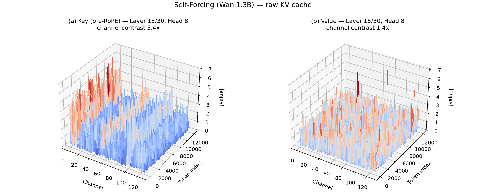
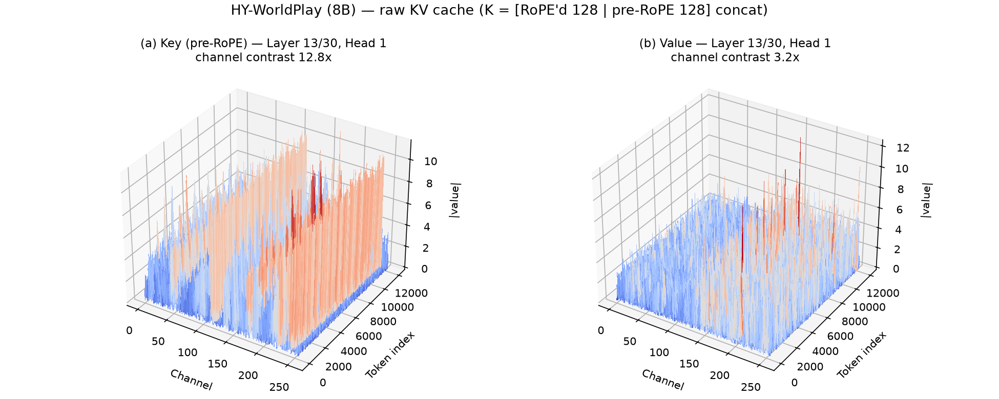
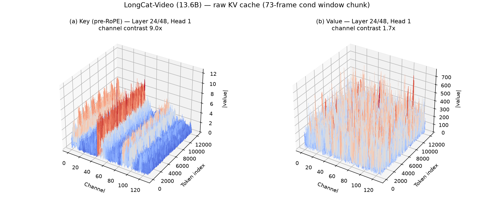
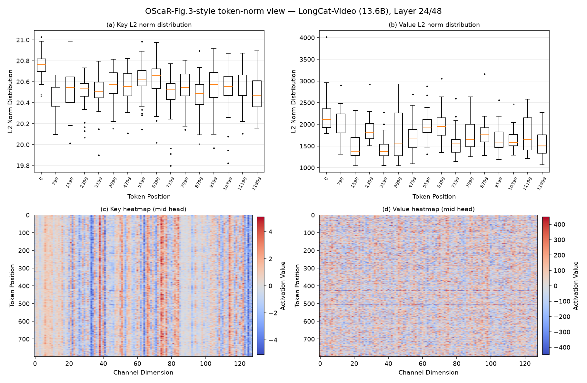
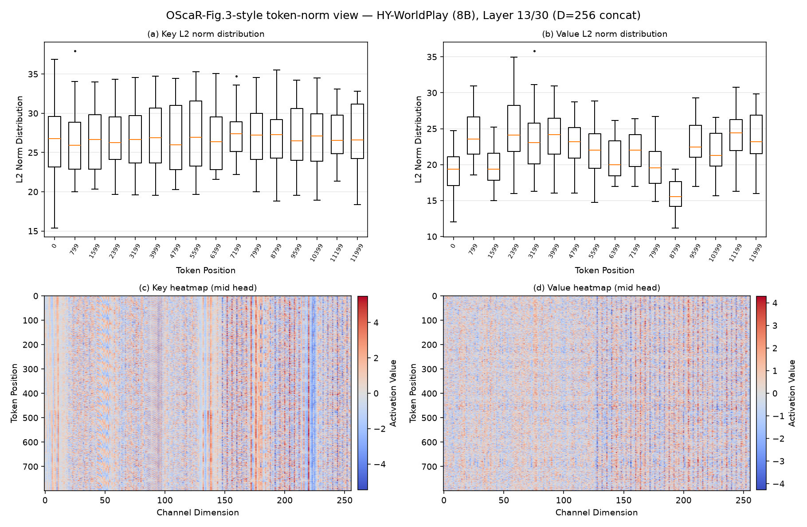

# 三模型 KV cache 分布可视化（OScaR Figure-2 风格）

动机：OScaR（papers/2605.19660）Figure 2 用 3D 幅值曲面展示 LLM 的 K 有通道墙、V 平坦，
以此论证 KIVI 轴向分工。本文档在 **QVG 的三个视频生成模型**上复刻同款图，检验视频 DiT
是否同构。图轴：X=channel、Y=token index（12k token 窗口）、Z=|value|；head 自动选
K 通道对比度（通道中位数最大/中位）最高者，K/V 同 head 同层。

数据：真实生成中捕获的原始（量化前）cache 张量。SF 用既有 dump
（`results/ropestudy/kv_cache_frames180.pt` layer 15/30）；LC/HY 用
`kvplot_launcher.py` 现场捕获（`ChunkedKVCache.write` / `compress_kv_cache` 双钩子，
`results/kvplot/`）。绘图脚本 `repro/backup/scripts/plot_kv3d.py`。

## Self-Forcing (Wan 1.3B) — Layer 15/30, Head 8

- **K（pre-RoPE）：有通道墙**，对比度 **5.4×**，集中在低编号 channel——LLM 同款结构，
  只是强度弱于 Llama 级别的墙。
- **V：平坦**，对比度 **1.4×**，仅零星孤立 token 尖峰。

## HY-WorldPlay (8B) — Layer 13/30, Head 1

- 结构注记：HY 的 relative-rope 变体缓存的 K 是 **[RoPE 后 128 维 ‖ pre-RoPE 128 维]
  拼接成 256 维**（`arwan_w_action_w_mem_relative_rope.py:179-184`），量化对象即这 256 维。
- **K：通道墙显著强于 SF**，对比度 **12.8×**，且高墙集中在 **pre-RoPE 那一半**
  （channel 128-255）——与我们的 RoPE 分散推导（[rope-dispersion.md](rope-dispersion.md)）一致：
  RoPE 旋转把通道结构打散，pre-RoPE 半边保留完整的结构性尖刺。
- **V：平坦（3.2×）但出现数根孤立的大 |值| token 尖针**——OScaR 描述的
  "exceptionally large-norm token" 模式在视频模型中同样存在（多模态型 TNI 的雏形）。

## LongCat-Video (13.6B) — Layer 24/48, Head 1

- 捕获自 `compress_kv_cache` 入参（48 层调用 ✓），单 chunk = 29,640 token——**与 BPE
  对账推出的 73 帧条件窗完全一致**（report-0714 §2 的独立旁证）。
- **K（pre-RoPE）：通道墙清晰**，对比度 **9.0×**（channel ~30-50 一道贯通红墙）。
- **V：形状平坦（1.7×）但绝对幅值巨大**——|值| 常态数百、峰值 ~700（同层 K 只有 ~12）。
  分布均匀所以逐 token scale 量化无碍，但这解释了 V 为什么绝不能和 K 共用任何量化参数。

## 三模型对照与结论

| 模型 | K 通道对比度 | V 通道对比度 | K 墙位置 | V 异常 |
|---|---:|---:|---|---|
| Self-Forcing 1.3B | 5.4× | 1.4× | 低编号 channel | 零星尖峰 |
| HY-WorldPlay 8B | 12.8× | 3.2× | pre-RoPE 半区 | 孤立大值 token 针 |
| LongCat 13.6B | 9.0× | 1.7× | channel ~30-50 红墙 | 幅值巨大（~700）但均匀 |

结论：
1. **三个视频 DiT 的 K/V 分布与 LLM 同构**——K 全部有结构性通道墙（5.4× / 12.8× / 9.0×）、
   V 全部平坦（1.4× / 3.2× / 1.7×）。KIVI/OScaR 轴向分工的前提在视频模型上成立；也给
   "QVG 必须靠 k-means 质心吸走 K 的通道结构才能活在 per-token 轴上"（report-0714 §1）
   提供了分布层面的可视化证据。
2. **墙的强度并非单调随规模**：SF 1.3B（5.4×）< LC 13.6B（9.0×）< HY 8B（12.8×）——
   架构因素（HY 的 [RoPE‖pre-RoPE] 拼接 cache，墙集中在 pre-RoPE 半区）比参数量更相关。
   HY 图同时印证了 RoPE 分散推导：RoPE 过的半区通道结构明显弱于 pre-RoPE 半区。
3. **两处 OScaR 式 token 级异常也在视频模型中出现**：HY 的 V 有孤立大 |值| token 尖针；
   LC 的 V 整体幅值高达数百（massive-activation 风味）但均匀。对我们的 per-token 方法
   无害，但任何跨 token 共享参数的方案（per-channel 路线）在视频模型上会同样撞上 TNI。

## Token norm 统计（OScaR Figure-3 风格，0714 补充）

按 OScaR 式 5 的口径（每个 token 位置跨 head 的 L2 norm 集合做箱线图 + 中位 head 热图），
K/V 各一列。脚本 `repro/backup/scripts/plot_token_norms.py`。

| 模型 | K 的 token norm 参差（median 极值比） | V 的参差 | 备注 |
|---|---:|---:|---|
| Self-Forcing 1.3B | 1.41× | 3.54× | |
| LongCat 13.6B | **1.03×**（几乎完全钉平） | **5.60×** | V 幅值 1000~2800，另有单个 ~4000 的大 norm token（热图中一条红色横线） |
| HY-WorldPlay 8B | 1.27× | 4.66× | |

### 读数：视频 DiT 的 TNI 图景与 LLM 相反

1. **K 侧没有 TNI**。三模型的 K token norm 都非常平（LC 近乎完美的 1.03×，疑似 QK-Norm
   把 K 的 norm 钉住了；SF/HY 也只有 1.3-1.4×），箱线图上**不存在 OScaR 在 LLM 里看到的
   低 norm attention-sink 离群 token**——video cache 里没有 BOS/文本类特殊 token。
   推论：OScaR 的病灶（per-channel K 量化被 TNI 放大误差）**在视频模型上基本不存在**，
   per-channel 路线搬到视频模型反而比在 LLM 上更安全（修正本文档上一节结论 3 的猜测）。
2. **TNI 式的参差全在 V 侧**（3.5~5.6×，LC 还有孤立大 norm token）——但所有主流方案的 V
   本来就走 per-token 轴（每 token 自带 scale），天然免疫。
3. 合并结论：视频模型上"K 有通道墙、V 有 token norm 参差"，恰好各自撞在对方量化轴的
   安全区里——**K 的病要用旋转/质心治（channel 轴），V 的病用 per-token scale 就自动痊愈**。
   这从分布层面完整解释了为什么 QVG 的对称 per-token 设计（加 k-means 吸墙）和
   KIVI/OScaR 的轴向分工在视频上都能工作。
