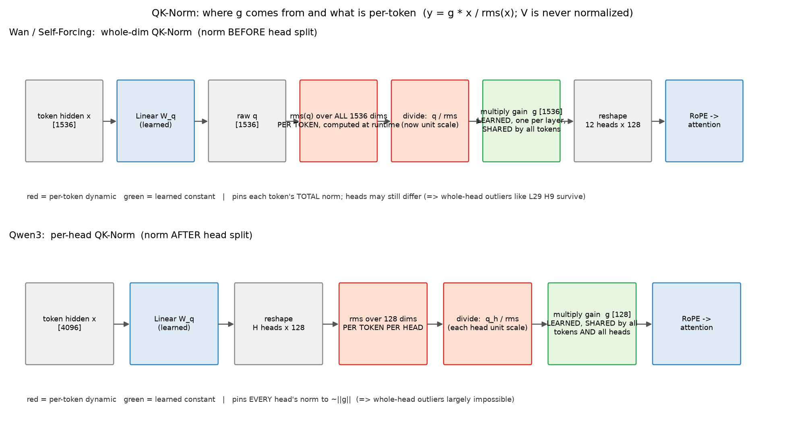

# QK-Norm 的工作机制（g 从哪来、什么是逐 token 的）

一句话：**QK-Norm = 在 Q/K 投影之后、RoPE 之前，对每个 token 的 q/k 向量做一次 RMSNorm**：

```
y = g ⊙ x / rms(x)，   rms(x) = √(mean(x²) + ε)
```



## g 是怎么来的——三个关键事实

1. **g 是训练学出来的模型参数**（`nn.Parameter`），随梯度更新，推理时冻结。它不是按输入算的。
2. **g 不随 token 变**：一层一份，所有 token（所有位置、所有帧）共用。逐 token 变化的只有
   分母 rms(x)——那是运行时从每个 token 自己的向量算出来的（图中红色 = 逐 token 动态，
   绿色 = 学习后冻结的常量）。
3. **g 的形状取决于变体**：
   - Qwen3：`q_norm.weight` 形状 **[128]**（head_dim），全部 head 也共用这一份
     （`reference/modeling_qwen3.py:195-196`，注释 "only on the head dim"；调用在 217-218）
   - Wan/SF：`norm_q.weight` 形状 **[1536]**（整个 dim，12 头拼接后归一再切头，
     `experiments/Self-Forcing/wan/modules/model.py:124-125, 139-140`）
   - V 从不做 QK-Norm——它不参与点积，没有 logit 爆炸问题。

## 为什么存在：训练稳定性

注意力 logit = q·k/√d ∝ ‖q‖·‖k‖。若个别 token 的 q/k norm 无界增长，softmax 会饱和成
one-hot → 梯度消失、loss 尖刺。QK-Norm 把两者钉在 ~‖g‖ 量级，logit 从此有界
（ViT-22B 一系的大模型稳定性组件，Wan/Qwen3 这代标配）。

## 两个变体的差别——直接对应我们的观测

| | Wan/SF：whole-dim（先归一后切头） | Qwen3：per-head（先切头后归一） |
|---|---|---|
| rms 的计算范围 | 整个 1536 维（12 头合账） | 每头 128 维（分头记账） |
| 钉住的量 | token 的**总** norm | **每个 head** 的 norm |
| head 间失衡 | **允许**（总量守恒下可向单头倾斜） | 基本不可能 |
| 我们的对应观测 | SF L29 的 H9 整头 norm≈105（qkv-anatomy.md §3） | 预测：Qwen3 系模型不应有整头离群（待验证） |

## 与 TNI 讨论的关系（0714 勘误）

- QK-Norm 把 token 间 norm **压窄**（LC 的 K 1.03×、SF/HY 1.3-1.4×，kv-distributions.md），
  但**压窄 ≠ 拉平**：g 是逐通道的，token 方向若落在小 |g| 通道上出来 norm 仍偏低——
  **Qwen3 带 QK-Norm 仍被 OScaR 观察到低 norm 离群 token**（其附录 D），
  "QK-Norm 阻止 TNI" 的假设不成立。
- 视频 DiT K 侧无 TNI 的更站得住的解释：**文本条件走 cross-attention，self-attention 的
  cache 里只有视频 patch token**——没有 BOS/标点这类可当 sink 的无信息 token，
  sink 的形成土壤不存在。
