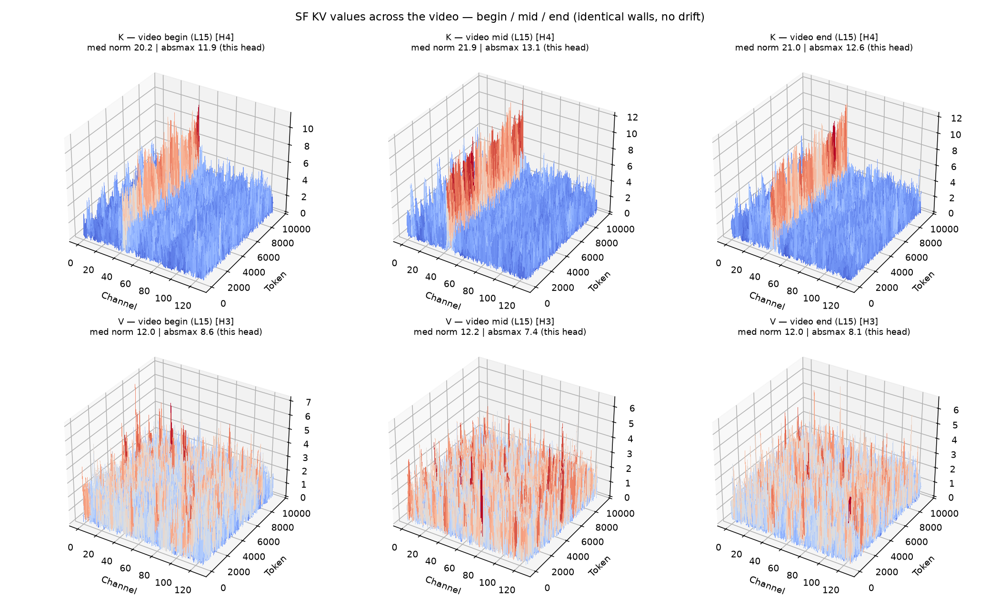
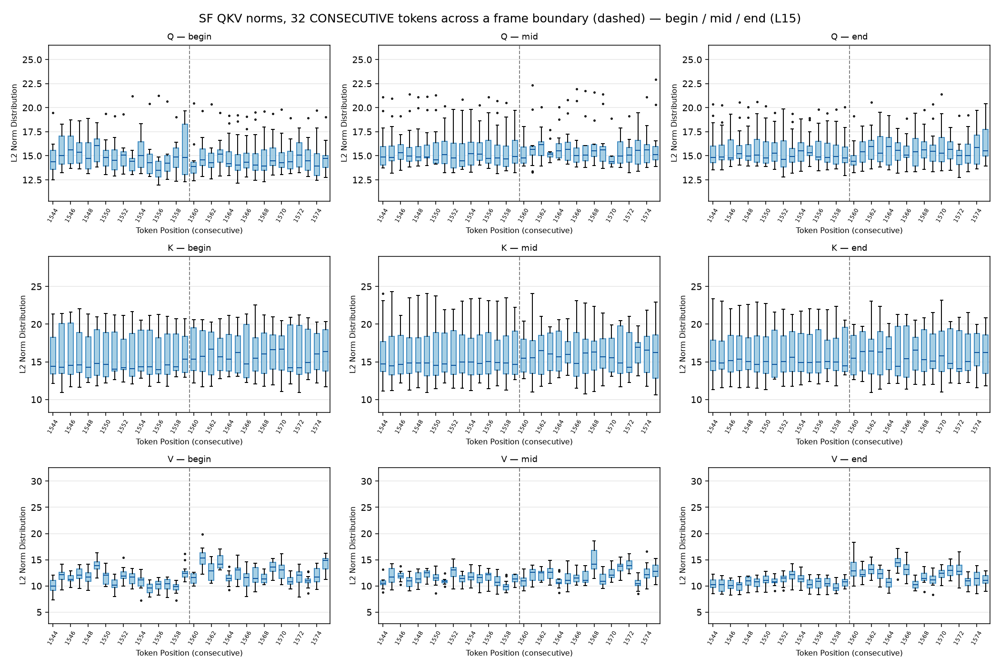
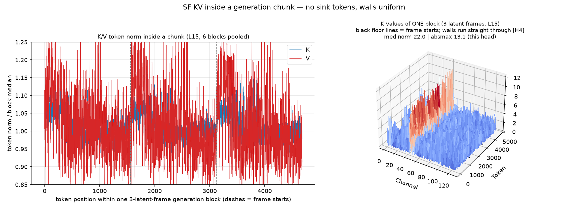
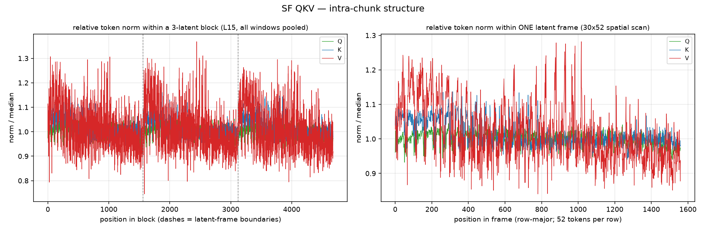
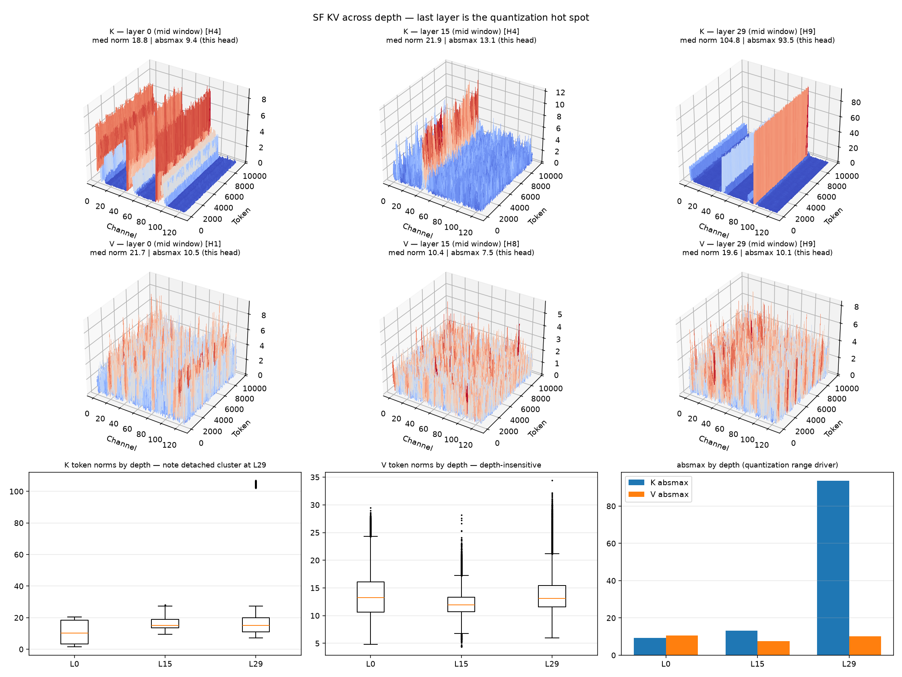
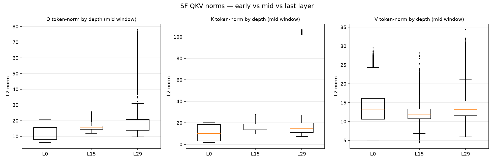

# Self-Forcing：KV 值 与 QKV norm 解剖

> 对象：Self-Forcing（Wan 1.3B）
> 指标：① K/V 的值（token×channel 热图） ② Q/K/V 的 norm 分布
> 角度：视频前后 ／ chunk 内部 ／ layer 深浅
> 数据：180 帧 bf16 生成中现场捕获——layer {0,15,29} × 时间窗 {帧0-5, 87-92, 174-179}，
> K 为 pre-RoPE 原始值，Q 取每 block 最后去噪步（dump `results/kvplot/sf_qkv.pt`）

## 0. TL;DR 总表

| 角度 | KV 值的发现 | QKV norm 的发现 |
|---|---|---|
| 视频前后 | K 的通道墙位置/强度全程不变；V 全程均匀噪声 | 三窗箱形重合，中位变化 <5%，无漂移 |
| chunk 内部 | 通道墙笔直贯穿帧边界，块内均质 | 无 sink token；仅帧起点 K 抬升 ≤10%，V 噪声 ±20% 无规律 |
| layer 深浅 | K 随深度恶化：absmax 9.4→13.1→**93.5（7×）**；V 三层不变 | **L29 的 K 有一个整头离群的 head（H9，全头 norm≈105 vs 其他头 15）**，Q 同层拖尾至 78；V 深度不敏感 |

---

## 1. 角度一：视频前后（开头 / 中段 / 结尾）

### 1.1 KV 值

读数：三个时间窗的 K 曲面几乎是同一张图——通道墙的位置和强度全程不变（absmax
11.9/13.1/12.6）；V 三窗同样都是均匀噪声（absmax 8.6/7.5/8.1）。

### 1.2 QKV norm

读数：Q/K/V 三者的箱形在三窗几乎重合——Q 中位 14.7→15.3→15.4、K 14.4→14.7→14.9、
V ≈11.8 全程不动；离群尾的形态也一致。

### 1.3 小结

**KV 分布不随视频进度漂移。**一套量化参数/一套质心全程适用；"视频越长尾部越难压"不成立；
流式质心热启动（paper §4.3）能工作的分布学基础就在这里。

## 2. 角度二：chunk 内部

### 2.1 KV 值

读数：右图单个 3-latent block 的 K 曲面——**通道墙笔直穿过两条帧边界**（黑虚线），
块内完全均质；左图 K/V norm 逐位置曲线：K 仅在每个 latent 帧起点后有 ≤10% 的抬升随即回落。

### 2.2 QKV norm

读数：Q 最平（帧界几乎无反应）；K 帧起点小峰（≤10%）；V 逐点噪声 ±20% 但与位置无关。
帧内空间扫描（右图）：帧顶部若干行 K 略高 ~8%，随行数衰减。

### 2.3 小结

**chunk 内部没有 sink 式特殊 token，不需要按位置区别对待。**OScaR 在 LLM 里看到的
"固定位置的异常 token"在 SF 的 chunk 结构里不存在。

## 3. 角度三：layer 深浅（L0 / L15 / L29）

### 3.1 KV 值

读数：K 随深度单调恶化——L0 几根锐利的窄墙（最易压）、L15 墙变宽、
**L29 出现覆盖半个 channel 轴的巨墙，absmax 爆到 93.5（中间层的 7 倍）**；V 三层始终
均匀噪声（absmax 10.5/7.5/10.1）。每格曲面自动选该张量 absmax 最大的 head（标题 [Hx]），
L29 的巨墙整个属于 head 9。底排 absmax 柱状图一眼可见 L29 的 K 独高。

### 3.2 QKV norm

读数：**L29 的高 norm "簇"实为一整个离群 head**——3D 曲面的 head 选择暴露了真相：
H9 全头的 K norm 中位 104.8，其他 head ~15，7 倍分离；箱线图里悬空的那团就是 H9 的全部
token。Q 同层的大离群（absmax 71）也在同方向。L0/L15 两层干净，V 三层箱形几乎相同。

### 3.3 小结

**量化难度集中在末层的 K（和 Q），V 对深度完全不敏感；且末层的离群是 head 级的**
（整个 H9 均匀放大 7 倍），不是 token 级。head 级均匀放大对"组不跨 head"的方案
（QVG/RTN/我们的 QuaRot，块都在 head 内）本身无害——真正的威胁是该 head 内部
更猛的通道墙（absmax 93.5）撑大块内 scale。

---

## 4. 统计总表

（每格：median norm ｜ token-norm 极值比 ｜ absmax）

| Layer | 窗 | Q | K | V |
|---|---|---|---|---|
| L0 | begin | 11.1 ｜ 1.32× ｜ 10.4 | 7.7 ｜ 2.04× ｜ 9.3 | 12.1 ｜ 2.82× ｜ 10.8 |
| L0 | mid | 11.1 ｜ 1.21× ｜ 10.2 | 7.6 ｜ 1.77× ｜ 9.4 | 12.4 ｜ 2.69× ｜ 10.5 |
| L0 | end | 10.9 ｜ 1.28× ｜ 10.2 | 7.1 ｜ 1.79× ｜ 9.2 | 12.2 ｜ 2.33× ｜ 10.5 |
| L15 | begin | 14.7 ｜ 1.30× ｜ 16.4 | 14.4 ｜ 1.35× ｜ 11.9 | 11.8 ｜ 3.43× ｜ 8.6 |
| L15 | mid | 15.3 ｜ 1.22× ｜ 14.1 | 14.7 ｜ 1.35× ｜ 13.1 | 11.8 ｜ 2.65× ｜ 7.5 |
| L15 | end | 15.4 ｜ 1.21× ｜ 14.3 | 14.9 ｜ 1.34× ｜ 12.6 | 11.6 ｜ 2.75× ｜ 8.1 |
| L29 | begin | 15.1 ｜ 1.35× ｜ **71.0** | 14.5 ｜ 1.27× ｜ **94.0** | 12.1 ｜ 2.76× ｜ 10.5 |
| L29 | mid | 16.8 ｜ 1.39× ｜ **64.5** | 14.9 ｜ 1.22× ｜ **93.5** | 12.8 ｜ 2.39× ｜ 10.1 |
| L29 | end | 16.3 ｜ 1.33× ｜ **62.0** | 14.8 ｜ 1.18× ｜ **93.5** | 15.0 ｜ 2.21× ｜ 10.0 |

## 5. 结论与可动手的推论

1. **按深度重分配量化预算**：末层 K 的 absmax 是中间层 7 倍，同样块结构下 scale 被撑大
   7 倍——末层 K 用细块/高位宽/离群旁路、浅层更狠，是免费的质量空间（现成可跑的新实验）。
2. **对 QVG 设计的解释**：k-means 按 head 独立聚类，H9 这种整头放大对它完全透明；
   头内的通道墙主体也被质心吸收——QVG 无离群保护也能工作的结构性原因。
3. **对跨 head 共享参数方案的警示**：任何把量化组/旋转/scale 跨 head 共享的设计
   （例如 head 拼接后统一分块），在 L29 会被 H9 整头 7× 的幅值差撑爆——SF 的教训是
   **一切量化参数至少要 per-head**。

## 6. 方法与局限

采集：`qkv_capture_launcher.py` 钩在 `attn_kv_cache_prerope`（q/k/v 原始入参，K 未加
RoPE），同一 block 每个去噪步覆盖写，留存最后一步。绘图：`plot_sf_kv_summary.py`（KV 值）、
`plot_qkv_anatomy.py`（QKV norm）。
局限：单模型（SF）、单 prompt（滑板手）、每窗 2 个 block、Q 只取最后去噪步；LC/HY 的
同款解剖与跨去噪步的 Q 演化留作后续（采集器已通用化，各一条 pod 即可）。
