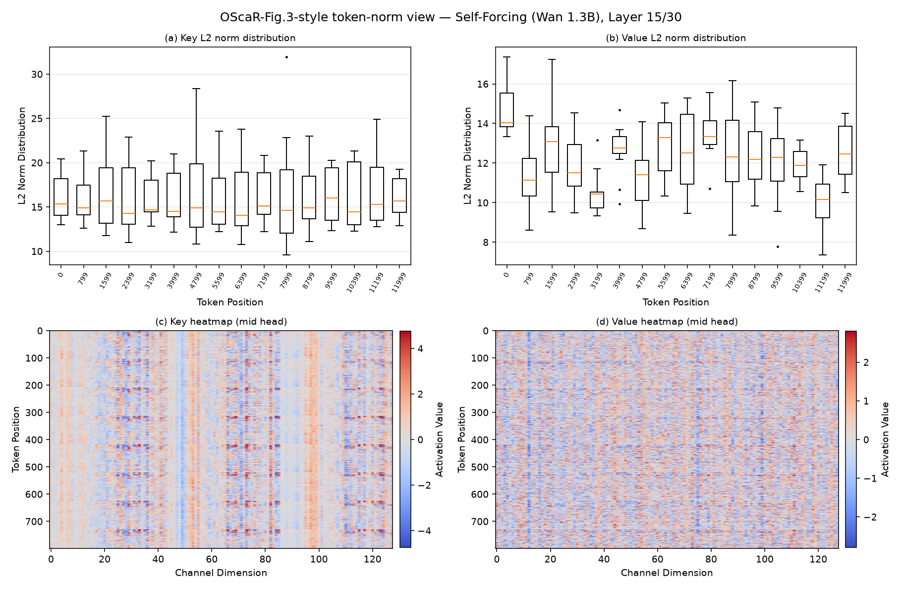
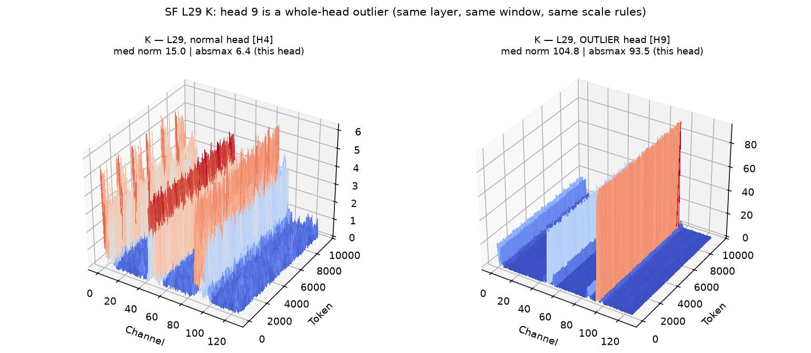
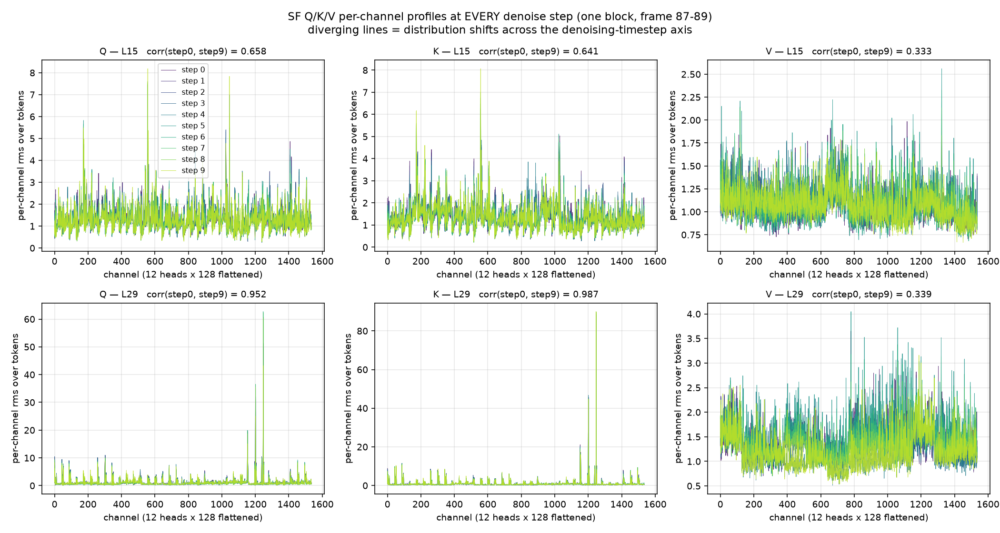

# Report 0714

今天的 update，五件事。细节全部在各专题 md 里，这里只放结论和关键数字。

## 1. BPE：他们的账其实是诚实的

精确公式 `BPE = r + 8/B + S·8/128 + S·(256·128·16)/(N·128)`，与 README 实测显存**逐字节对上**
（67.318 MB/层 vs 日志 67.32）。paper Table 1 的全部压缩率都能被公式重现——质心、索引、
scale 全计入，账目结构没毛病。仅有的两个小瑕疵：①Table 1 的 6.94× 隐含 ~35k token 的
chunk，发布配置实际 29,640 → 只有 6.88×（高报 0.8%）；②附录 Table 5 的 K 扫描漏记了
scale 项。另有免费空间：三元残差按 trit 打包可再赚 16-22%（6.88×→~8.3×，零质量代价）。

**各方法 BPE 一览**（INT2，块级标量记 FP8；QVG 系含索引+质心、按 LC 发布 chunk 29,640 token 分摊；QuaRot 系与序列长度无关）：

| 方法 | 账单（bit/元素） | **BPE** | 压缩率 | frame-93 PSNR |
|---|---|---:|---:|---:|
| QVG（S=1, B=64） | 2 + scale 0.125 + 索引 0.0625 + 质心 0.138 | **2.326** | 6.88× | 28.88 |
| QVG-Pro（S=4, B=16） | 2 + 0.5 + 0.25 + 质心 0.553 | **3.30** | 4.85× | **31.04** |
| QuaRot 非对称 B=64 | 2 + scale 0.125 + zero-point 0.125 | **2.25** | 7.11× | 28.85 |
| QuaRot 非对称 B=16 | 2 + 0.5 + 0.5 | **3.0** | 5.33× | 30.38 |
| QuaRot 对称 B=64 | 2 + 0.125（无 zero-point） | **2.125** | 7.53× | 19.14 |
| QuaRot 对称 B=16 | 2 + 0.5 | **2.5** | 6.40× | 21.42 |

两个读法：①同预算档位各有胜者——2.25~2.33 档 QuaRot 非对称 B64 与 QVG 打平（28.85 vs 28.88），3.0~3.3 档 QVG-Pro 胜非对称 B16 0.66 dB；②对称行省下 zero-point 的 0.125~0.5 bit，代价是 9 个 dB——全表性价比最差的钱。
→ 细节：[details-0714.md](details-0714.md) §2

## 2. Quant block 大小：QVG 的 k-means 已经把残差 smooth 得够好，B 不敏感

QVG 发布配置是 **B=64**。九宫格 B 扫描（INT2，frame-93 口径）：

| B | 16 | 64 | 128 |
|---|---:|---:|---:|
| QVG (S=1) | 30.96 | 28.88 | **28.41** |
| QuaRot 非对称 | 30.38 | 28.85 | **24.54** |
| QuaRot 非对称 + clip (r=0.99) | 30.68 | 29.07 | **25.35** |

关键对比在粗块端：**64→128 QVG 只掉 0.47 dB，QuaRot 崩 4.31 dB（9 倍差距）**——质心减掉
结构性尖刺后，残差对 scale 粒度不再敏感；QuaRot 面对的原始 KV 则块越粗越被离群拖垮。
clip（旋转后逐块收缩 r=0.99）能给 QuaRot 回血且增益随 B 变大（+0.30/+0.22/+0.81）——
方向符合"clip 治块内离群"，但补不回粗块的塌方（B=128 加 clip 后 25.35，仍离 QVG 3 dB）。
（细 scale 依然值钱：16→64 QVG 也有 −2.08，但那属于"锦上添花"而非"生死线"。）
副产物：QVG-Pro 的 +2.16 dB 优势里 S=4 只贡献 +0.08，其余全来自 B=64→16。
→ 细节：[b-sweep.md](b-sweep.md)

## 3. 按 paper 口径的速度实测（H100，同 GPU 上 bf16/QVG 各跑完整生成）

paper 只声称"INT2 比 bf16 慢不超过 1.5~4.3%"。我们按它自己的方法实测，**三个模型全是
负开销（INT2 更快）**：

| 模型（发布工作量） | bf16 端到端 | QVG INT2 端到端 | 差 |
|---|---:|---:|---:|
| LongCat（10 段全量） | 2977 s | 2385 s | **−19.9%** |
| Self-Forcing（180 latent） | 605 s | 575 s（稳态；含编译的首遍 599 s） | **−5.0%** |
| HY-WorldPlay（12 chunk 匹配几何，稳态 chunk 4-11 口径） | 60.1 s（7.52 s/chunk） | 42.0 s（5.25 s/chunk） | **−30%** |

HY 已核验：此前墙钟口径的 −68% 是**运行顺序造成的缓存假象**——bf16 臂在 pod 里第一个跑，
独自支付了冷 PVC 的权重加载与各类首次初始化（635s 墙钟里约 431s 是非生成开销；qvg 第二三遍
只有 ~95s），扣除后按稳态 chunk 对比得 −30%，与旧证据（异节点 −24%）和 LC 的 −20% 同量级。
加速来源是访存不是计算（cache 22.3GB→3.2GB 的搬运量差）。另一个对齐结论：附录 C 的
"SF 180 帧 43s" 之谜已解——发布脚本实际生成 717 帧（4 倍工作量），按块折算后同量级。
→ 方法口径：[details-0714.md](details-0714.md) §3（实测数字待补入 §3.5）

## 4. OScaR 的 Token Norm Imbalance（TNI）分析，搬到视频模型上：不成立，且原因清楚

**背景（OScaR 在 LLM 上发现了什么）**：OScaR（arXiv:2605.19660）指出 LLM 的 KV 量化被
TNI 卡住——若同一个量化组里的 token 的 L2 norm 差距悬殊，共享的量化 scale 会被大 norm
token 撑大，小 norm token 被粗步长碾碎。LLM 里的病灶是 **attention sink**：BOS、标点这类
无语义 token 被训练成"注意力下水道"，其 K/V norm 异常低；关键是 decoder-only LLM 里
prompt（含这些 sink token）和生成 token 在**同一条 self-attention 序列**里，sink 就存在
被量化的 KV cache 中。

**我们的检验**：把 OScaR 的测量方法（其式 5：每个 token 位置画跨 attention head 的 norm
分布箱线图）原样搬到 QVG 的三个视频模型上，测量真实生成中捕获的 KV cache：

| 模型 | K 的 token norm 极值比 | 低 norm 离群 token |
|---|---:|---|
| LongCat-Video 13.6B | **1.03×** | 无 |
| HY-WorldPlay 8B | 1.27× | 无 |
| Self-Forcing 1.3B | 1.41× | 无 |

（LLM 里 sink 与正常 token 的 norm 差是数量级的；1.0-1.4× 意味着完全平坦。）

**为什么视频没有 TNI——架构原因**：视频 DiT 的文本（含 BOS/标点这些 sink 载体）走的是
**cross-attention**（512 个 text token 的静态小 buffer，不量化、不增长）；被量化的
self-attention cache 里**只有视频 patch token**，每个都携带内容——经典 sink 没有载体。

**视频真正的离群换了一根轴**：SF 最后一层（L29）的 **head 9 整头** K norm ≈105（其他 11
个头 ~15，7 倍）。归因到底：是 W_k 把每个 token 的能量集中投到该头的 ch95/ch49 两根通道
（16.6× 能量集中）× QK-Norm 的增益 g 在同一批通道上学出 3-5 倍（两者相乘）。这是
**head/channel 级**的离群——治它的是"量化参数不跨 head + 通道级手段（旋转/质心/细块）"，
OScaR 的 token 级归一化（OTS）在视频上既治不了也不需要。

**一条勘误**：QK-Norm 并不能阻止 TNI——Qwen3 带 per-head QK-Norm，OScaR 仍在其上观察到
sink（其附录 D）；QK-Norm 只负责把 norm 分布压窄。

**对量化设计的含义**：per-channel 路线（KIVI/OScaR 系）搬到视频 K 上反而比在 LLM 上更安全；
QVG 不做任何 sink/token 保护是合理的，不是疏忽。

## 5. DeltaQuant：timestep 维度的 activation 动态性（与 KV cache 的静态性形成对照）

**背景**：SVDQuant 是图像扩散模型 W4A4（权重+激活 4-bit）的 SOTA——权重侧用 SVD 低秩分支
吸离群，激活侧用**离线校准的静态 per-channel smoothing**。DeltaQuant（CVPR 2026，
MIT/Nunchaku/NVIDIA）发现把它直搬视频扩散会崩，并给出诊断：**视频扩散的激活离群通道和
幅值随去噪 timestep 剧烈变化**（其 Fig.4a：同一层激活在 step 0 和 step 20 的离群通道
完全不同）；按某一步校准的静态 smoothing 因子，在其他步**反而放大离群**（Fig.4b）。
他们的解法是把激活切成时空 3D cube、cube 均值当 core token（FP8）、只量化 delta（4-bit）
——运行时现算，天然适应每一步的分布。这与我们自己的观察一致：不同 timestep 下 activation
的差距确实很大。

**我们自己的第一个 token-norm 分析（视频开头/中间/结尾的 K）放在这里做对照**：
在 SF 真实生成中，取帧 0-5 / 87-92 / 174-179 三个窗口，按 OScaR 式 5 的口径画每个 token
位置跨 head 的 K norm 箱线图：

结果是**三个窗口的分布几乎完全一致**——K 的 norm 中位数 14.4 → 14.7 → 14.9（<5%），
箱形与离群尾形态重合，K/V 值的 3D 曲面（通道墙位置/强度）也逐窗不变。
**注意：这不是"不同 timestep 分布很不一样"——恰恰相反，沿视频位置轴 KV 是平稳的。**
"分布剧变"发生在另一根轴上：

| 轴 | 谁在变 | 实测/文献结论 |
|---|---|---|
| **视频位置轴**（帧 0 → 帧 180，我们的开头/中间/结尾分析） | KV cache 存量 | **平稳**（上图）→ 一套量化参数/质心全程适用 |
| **去噪 timestep 轴**（step 0 → step T，DeltaQuant 的 Fig.4） | 激活 / Q/K/V 投影（每步重算） | **张量相关的漂移**（下图，我们的实测）|

**timestep 轴的实测**（SF，同一 block 在全部去噪 forward 的 Q/K/V per-channel 曲线，
每步一条线；SF 每 block = 4 去噪步 [t=1000/750/500/250] + 1 次干净上下文重编码）：

- **V 是模式级剧变**：corr(首步, 末步) ≈ **0.33**（两层都是），中位 norm 随去噪推进单调降
  1.5×——DeltaQuant 的诊断在 V 上完全成立；
- **中层 Q/K 中度漂移**：corr ≈ 0.64-0.66，离群通道的幅值随步伸缩数倍（模式部分重排）；
- **但最大的结构性离群是跨步静态的**：L29 那两根巨型通道（H9 ch95/49）corr = 0.95-0.99，
  每一步都在原位、等高。
- **对 KV cache 量化的好消息**：SF 的 cache 最终存的是**去噪完成后干净上下文重编码**那一次
  forward 的 K/V（timestep≈0，写入时机固定）——步间漂移不污染被量化的 cache。漂移真正
  打击的是**激活侧**方案（W4A4、Q 量化、逐步的 fake-quant proxy）。

**回答"image 为什么没事"**（关键辨析）：image 扩散同样多步、激活同样随步变——这在
Q-Diffusion/PTQ4DM（2023）就是已知问题。SVDQuant 能在 image 上活，是因为它的激活量化
本身是**运行时逐 token 动态 scale**（幅度级变化被自动吸收），静态的只有 per-channel
smoothing 因子 λ——只要离群通道的**身份和相对比例**跨步稳定（image 大体如此），λ 就有效。
video 的问题（DeltaQuant Fig.4 + 我们上图的 V/中层 Q/K）是**模式级**变化：通道模式本身
重排，任何静态 per-channel 向量都无法同时适配。DeltaQuant 论文没有给出 image 侧的对照
（我们检索确认），这一辨析是我们补的。

KV cache 量化幸运地只暴露在第一根轴上（cache 是跨步复用的存量，每 chunk 只压一次）；
但任何**激活侧**方案——W4A4、Q 的量化、基于注意力输出的 proxy 指标——都必须处理第二根轴。
我们目前的 Q 统计只采过每 chunk 的最后一个去噪步，跨步演化未测，已列入待办。

**方法论巧合**：DeltaQuant 的"减局部均值、量化残差"与 QVG 的"减聚类质心、量化残差"同构
——两家都在用视频的时空冗余当杠杆，只是一个作用在激活的 3D cube、一个作用在 cache 的
token 聚类上。

---

遗留待收尾：0714 三件套（HANDOFF/REPRODUCE）。
