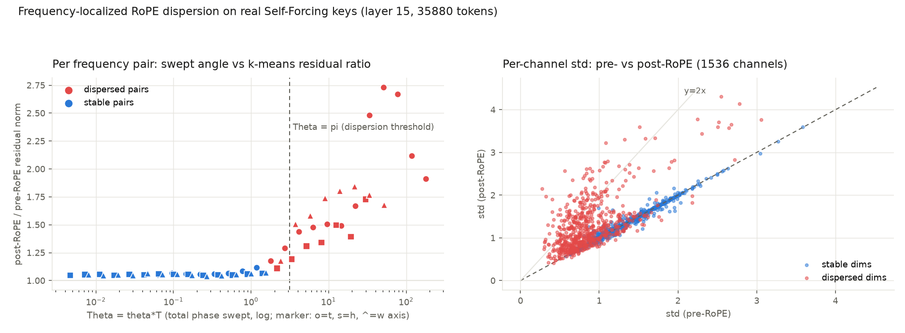

# 为什么 RoPE 让 K 分布更分散、更难聚类和量化？——推导 + 真实数据验证

> 起因：QVG 采用 pre-RoPE key caching（"more quantization-friendly key distributions"）。本文回答"为什么"。
> 方法：形式化推导（§A）+ 用 Self-Forcing 真实 KV cache（49GB dump，layer 15，35,880 token）做数值验证（§B）+ 独立对抗审查（§C）。三方由并行 agent 独立完成后交叉复核。

## 结论（一段话）

RoPE 把「内容相同、位置不同」的一族 key 从一个点展开成高维环面上的轨道。每个 2 维频率对的均值按 Dirichlet 核 |D_N(θ)| 收缩、方差按 1−D_N² 注入，存在清晰的双 regime：**θ·T ≪ 1 的低频对几乎冻结，θ·T ≳ π 的高频对被打散成整圆**。真实数据完全证实了这个频率局域化预测：分散对的 k-means 残差恶化 **+63%**，稳定对仅 **+5.6%**；全部 124 个 std 翻倍以上的通道无一例外落在预测的分散集合内；整体上 k-means 重建误差 +25%、kmeans+INT2 管线误差 +26%。**尤其值得注意：pre-RoPE 时高频维度本是 K 最可聚类的部分（残差 0.398 vs 稳定维度的 0.519）——RoPE 恰好摧毁了结构最好的那一半。**这就是 pre-RoPE 缓存的价值所在。

## B. 真实数据验证（Self-Forcing K，模型自己的 3D RoPE 机制）



| 指标 | pre-RoPE | post-RoPE | 变化 |
|---|---:|---:|---|
| k-means (K=256) 重建 rel-L2 | 0.4731 | 0.5909 | **+25%** |
| kmeans+INT2 (B=64) 管线 rel-L2 | 0.3427 | 0.4321 | **+26%** |
| 分散维度 (θ·T≥π/2, 54/128) 残差 | 0.398 | 0.648 | **+63%** |
| 稳定维度 (74/128) 残差 | 0.519 | 0.548 | +5.6% |
| std 翻倍通道的归属 | — | 124/124 全在分散集合 | corr(log θT, 恶化比) = 0.78 |

方法要点：post-RoPE 用模型自身的 `rope_params/causal_rope_apply` 重构（与推理路径逐位一致），旋转保范数验证到 3.7e-16；pre/post 用同一子采样、同一 k-means 种子；分析脚本 `repro/0714/ropestudy/step{1,2}_*.py`，数据 `repro/0714/ropestudy_data.npz`。

## C. 对抗审查结论

独立审查复核：推导的全部代数（Dirichlet 核、双 regime、Wan 频谱对数、环面覆盖界的算术）**重算通过**；实测方法学忠实；频率局域化预测被强定量支持。范围性修订（已并入 §A 后的批注）：
1. 环面覆盖下界（引理 3）是连续极限的理想化——有限位置范围 (180,30,52) 下单个簇的轨道只是 3 参数族，256 质心"压不动"的定量结论不能逐簇照搬；实测的 +25% 整体恶化才是可引用的数字（"聚不动"是修辞过强）。
2. §A-4.3(ii) 的"块内满摆"机制假设沿 token 轴分块，而本仓库量化器沿通道轴分块——该机制适用于 KIVI 类 token 分块量化器；本仓库管线的 INT2 恶化主要继承自 k-means 残差变大。
3. 分散阈值约定：推导表用 Θ≥π（23 对），实测切分用 Θ≥π/2（27 对）；结果对两种约定均稳健。
4. pre-RoPE 的真实簇本就不是 ε-球（rel-L2 已 0.473），理想化的 post/pre 失真比公式与 C^{-2/m} 码本标度律未直接测量（可做码本扫描 C=64/256/1024 验证，留作后续）。

---

# A. 形式化推导（对抗审查修订前的原文，修订见 §C）

# 为什么 RoPE 之后 K 的分布更分散？——完整推导

**一句话结论**：RoPE 把「内容相同、位置不同」的一族 key 从一个点炸成一条（高维环面上的）轨道。每个 2 维频率对上，均值按 Dirichlet 核 $|D_N(\theta_i)|$ 收缩、方差按 $1-D_N^2(\theta_i)$ 注入；高频对被打散成整圆，聚类问题从"逼近一个点"变成"覆盖一个 $m$ 维环面"（码本效率从 $C^{-2}$ 恶化到 $C^{-2/m}$），同时逐通道的稳定均值被相位平均清零、通道对内方差被强制均衡，absmax 尺度失去可利用的"安静通道"。但这只发生在约 1/3 的高频对上——最低频的一半通道几乎原样保留。

---

## 1. 设定：RoPE 是分块对角的 2D 旋转

设 head 维度为 $D$（偶数）。某 token 的**内容向量**（pre-RoPE key）为 $x\in\mathbb{R}^D$，把它按相邻通道配对：$x=(x_1,\dots,x_{D/2})$，$x_i=(x_{2i},x_{2i+1})\in\mathbb{R}^2$。位置 $t$ 处的 post-RoPE key 为

$$k(t) = R(t)\,x,\qquad R(t)=\mathrm{diag}\big(R(\theta_1 t),\dots,R(\theta_{D/2}t)\big),\qquad R(\varphi)=\begin{pmatrix}\cos\varphi&-\sin\varphi\\ \sin\varphi&\cos\varphi\end{pmatrix},$$

频率 $\theta_i = \mathrm{base}^{-2i/D}$，$\mathrm{base}=10^4$，$i=0,\dots,D/2-1$。用复数记号最干净：令 $z_i=x_{2i}+\mathrm{i}\,x_{2i+1}\in\mathbb{C}$，则 RoPE 就是 $z_i\mapsto e^{\mathrm{i}\theta_i t}z_i$。

**Wan 式 3D RoPE**（对照 `wan/modules/model.py: rope_params` 与 `causal_model.py`，$d=\dim/\text{heads}=128$）：

```python
freqs = cat([rope_params(1024, d - 4*(d//6)),   # 时间轴: 44 维 = 22 对
             rope_params(1024, 2*(d//6)),       # 高度轴: 42 维 = 21 对
             rope_params(1024, 2*(d//6))])      # 宽度轴: 42 维 = 21 对
# rope_params: theta_i = 10000 ** (-2i / dim_axis)
```

即 64 个频率对按轴划分为 $(22,21,21)$，每对的旋转角是 $\theta_i^{(a)}\cdot p_a$，其中 $p_a\in\{t,h,w\}$ 是该 token 沿轴 $a$ 的坐标，且**每轴用自己的 $d_a$ 归一化**：$\theta_i^{(t)}=10^{4\cdot(-2i/44)}$，$\theta_j^{(h)}=\theta_j^{(w)}=10^{4\cdot(-2j/42)}$。下面的 1D 推导逐对成立，只需把 $t$ 换成对应轴坐标、位置范围换成该轴长度。（Wan 在 RoPE 前对 q/k 做 RMSNorm，这只是把内容向量放到球面上，不影响任何结论。）

---

## 2. 轨道引理：均值收缩 + 方差注入

**模型**：固定内容 $x$，它在位置 $t\in\{0,1,\dots,N-1\}$ 上均匀出现（$N$ 个位置；用 $\{0..T\}$ 完全同理）。这是"同一语义内容在不同帧/不同空间位置反复出现"的理想化——正是 k-means 想利用的冗余。

### 2.1 每对的均值：Dirichlet 核

几何级数求和：

$$\mathbb{E}_t\big[e^{\mathrm{i}\theta t}\big]=\frac1N\sum_{t=0}^{N-1}e^{\mathrm{i}\theta t}=\frac1N\cdot\frac{e^{\mathrm{i}\theta N}-1}{e^{\mathrm{i}\theta}-1}=e^{\mathrm{i}\theta (N-1)/2}\;\underbrace{\frac{\sin(N\theta/2)}{N\sin(\theta/2)}}_{=:D_N(\theta)} .$$

$D_N$ 是归一化 Dirichlet 核，$D_N(0)=1$，$|D_N(\theta)|\le 1$。于是对第 $i$ 对：

$$\mathbb{E}\big[R_i(t)\,x_i\big]=D_N(\theta_i)\,e^{\mathrm{i}\theta_i(N-1)/2} z_i\quad\Longrightarrow\quad \big\|\mathbb{E}[R_i(t)x_i]\big\|=|D_N(\theta_i)|\cdot\|x_i\|.$$

### 2.2 每对的方差

旋转保范数：$\mathbb{E}\|e^{\mathrm{i}\theta_i t}z_i\|^2=\|x_i\|^2$。所以协方差迹恰为

$$\operatorname{tr}\mathrm{Cov}\big(R_i(t)x_i\big)=\|x_i\|^2\big(1-D_N^2(\theta_i)\big),\qquad \operatorname{tr}\mathrm{Cov}\big(k(t)\big)=\sum_{i}\|x_i\|^2\big(1-D_N^2(\theta_i)\big).$$

Pre-RoPE 这个族是一个点，$\operatorname{tr}\mathrm{Cov}=0$；上式就是 **RoPE 注入的全部离散度**，逐对由 $1-D_N^2(\theta_i)$ 控制。

### 2.3 两个 regime

记 $\Theta_i:=\theta_i N$（该对在位置范围内扫过的总角度）。

**(a) 低频：$\Theta_i\ll1$ —— 无弥散。** Taylor 展开 $\sin u = u(1-u^2/6+\cdots)$：

$$D_N(\theta)=\frac{\tfrac{N\theta}2\big(1-\tfrac{(N\theta)^2}{24}\big)}{\tfrac{N\theta}2\big(1-\tfrac{\theta^2}{24}\big)}+O(\Theta^4)=1-\frac{(N^2-1)\theta^2}{24}+O(\Theta^4)\;\;\Longrightarrow\;\;1-D_N^2\approx\frac{\Theta_i^2}{12}.$$

方差 $\approx \|x_i\|^2\Theta_i^2/12$——正是"半径 $\|x_i\|$、张角 $\Theta_i$ 的小圆弧"上均匀分布的弦向方差。$\Theta_i\to0$ 时该对完全冻结。

**(b) 高频：$\Theta_i\gtrsim\pi$ —— 弥散成整圆。** 对 $0<\theta\le\pi$ 用 $\sin(\theta/2)\ge\theta/\pi$：

$$|D_N(\theta)|\le\frac{1}{N\sin(\theta/2)}\le\frac{\pi}{\Theta}\quad\Longrightarrow\quad 1-D_N^2\ \ge\ 1-\frac{\pi^2}{\Theta_i^2}.$$

$\Theta_i=2\pi$ 时方差已 $\ge 0.75\|x_i\|^2$；$\Theta_i\gg2\pi$ 时轨道绕圆多圈。由 Weyl 均匀分布定理（$\theta_i/2\pi$ 无理，$\theta_i=\mathrm{base}^{-2i/d_a}$ 一般满足），相位 $\{\theta_i t \bmod 2\pi\}$ 在圆上渐近均匀：该对被打散到**半径 $\|x_i\|$ 的整个圆**上，此时 $\mathbb{E}[Z_i]=0$，$\mathrm{Cov} = \tfrac{\|x_i\|^2}{2}I_2$（各向同性：$\mathbb{E}\cos^2=\mathbb{E}\sin^2=\tfrac12$，$\mathbb{E}\sin\cos=0$）。

顺带一个可观测的小细节：$D_N$ 在 $\Theta=2\pi k$ 处有零点——中等频率的对也可能恰好均值归零（下文 Wan 数字里 t 轴第 8 对 $\Theta=6.32\approx2\pi$，$|D_N|=0.006$）。

---

## 3. 对 k-means 的后果：从点到弧的乘积流形

**基准**：pre-RoPE 的一个"内容簇"是半径 $\varepsilon$ 的近点集（$\|k-\bar x\|\le\varepsilon$），**1 个质心**就能把失真压到 $\le\varepsilon^2$。Post-RoPE 它变成流形（的 $\varepsilon$-管）：

$$\mathcal{M}(\bar x)=\Big\{\big(e^{\mathrm{i}\theta_1t}z_1,\dots,e^{\mathrm{i}\theta_{D/2}t}z_{D/2}\big)\;:\;t\in[0,N]\Big\}\ \subset\ \prod_i \mathbb{S}\big(\|x_i\|\big),$$

即"每对一段圆弧（张角 $\Theta_i$，$\Theta_i\ge2\pi$ 时为整圆）"的乘积中的一条曲线。

### 3.1 轨道曲线几何

$k'(t)=A\,k(t)$，$A=\mathrm{diag}(\theta_i J)$（$J$ 为 90° 旋转生成元），故速度恒定：$\|k'(t)\|=\sqrt{\sum_i\theta_i^2\|x_i\|^2}$，弧长

$$L=\Big(\sum_i \Theta_i^2\,\|x_i\|^2\Big)^{1/2}\ \ge\ \Theta_0\|x_0\|.$$

Wan 时间轴 $\Theta_0=N=180$：**一个点的轨道弧长可达其范数的几十倍**（最高频对绕圆 $180/2\pi\approx29$ 圈）。

### 3.2 单个弥散对（$m=1$）：覆盖数下界

**引理 1（区间胞元的经典下界）**。对弧长参数均匀分布于长度 $L$ 的曲线段，若量化胞元是参数区间（高分辨率下最优胞元确实如此），长度 $\ell_j$，$\sum\ell_j=L$，则失真 $=\sum_j\frac{\ell_j}{L}\cdot\frac{\ell_j^2}{12}\ \ge\ \frac{1}{12}\Big(\frac{L}{C}\Big)^2$（幂平均不等式，均分取等）。弧上的弦距与弧距差一个 $\ge 2/\pi$ 的因子（$2r\sin\frac{\Delta}{2}\ge\frac{2}{\pi}r\Delta$，$\Delta\le\pi$），故欧氏失真 $\gtrsim \frac{4}{\pi^2}\cdot\frac{(L/C)^2}{12}$。

**引理 2（无任何胞元假设的严格版本）**。$X$ 均匀分布于半径 $r$ 的圆。若某 $C$ 点码本达到 $\mathbb{E}\min_j\|X-c_j\|^2=\delta^2$，Markov 不等式给出至少一半概率质量落在码本的 $\sqrt2\delta$-邻域内；而任一点的 $u$-球与圆的交是一段弧，其两端点弦距 $\le2u$，弧长 $\le \pi u$。于是 $\tfrac12\cdot2\pi r\le C\cdot\pi\sqrt2\delta$，即

$$\mathbb{E}\min_j\|X-c_j\|^2\ \ge\ \frac{r^2}{2C^2}.$$

两个引理都给出 $C^{-2}$ 标度：单对弥散只是"多花常数倍码字"。真正致命的是多对同时弥散：

### 3.3 多个弥散对：环面 + 维数灾难

设 $m$ 个对满足 $\Theta_i\ge2\pi$ 且频率(连同 $2\pi$)有理无关。由 Kronecker–Weyl，$(\theta_1t,\dots,\theta_mt)\bmod2\pi$ 在 $m$ 维环面上均匀分布（3D RoPE 更干净：不同轴的相位是**独立**坐标 $t,h,w$ 的函数，跨轴乘积测度精确成立）。极限分布是

$$X\sim\mathrm{Unif}\Big(\mathbb{T}=\prod_{i=1}^m\mathbb{S}(r_i)\Big)\subset\mathbb{R}^{2m},\qquad r_i=\|x_i\|.$$

**引理 3（环面覆盖下界）**。任意 $C$ 点码本满足

$$\mathbb{E}\min_j\|X-c_j\|^2\ \ge\ \frac{4m}{\pi e}\,\bar r_G^2\,(2C)^{-2/m},\qquad \bar r_G=\Big(\prod_i r_i\Big)^{1/m}.$$

*证明*：同引理 2，一半质量在码本的 $\sqrt2\delta$-邻域内。逐对有 内在弧距 $\le\frac{\pi}{2}\times$弦距，故欧氏 $u$-球与 $\mathbb{T}$ 的交包含于内在半径 $\frac{\pi}{2}u$ 的测地球；$\mathbb{T}$ 平坦，其体积 $\le\omega_m(\tfrac{\pi}{2}u)^m$，$\omega_m^{1/m}\le\sqrt{2\pi e/m}$（由 $\Gamma(x+1)\ge(x/e)^x$）。代入 $\tfrac12\prod_i(2\pi r_i)\le C\,\omega_m(\tfrac\pi2\sqrt2\delta)^m$ 整理即得。∎

**数值**：Wan 设定下（§5）严格满足 $\Theta\ge2\pi$ 的对有 $m=18$。取 $C=256$、等半径 $r$：$(2C)^{-2/m}=512^{-1/9}=\tfrac12$，下界 $=\frac{4\cdot18}{\pi e}\cdot\tfrac12\,r^2\approx4.2\,r^2$，而"1 个质心放在均值"的饱和失真是 $mr^2=18r^2$——**256 个质心只能把弥散子空间的失真压到饱和值的 ~23% 以上，无法更低**。且 RMS 误差随码本只按 $C^{-1/m}$ 下降：**码本翻倍只改善 $2^{-1/18}\approx4\%$**。这就是维数灾难版的"RoPE 之后聚不动"。

### 3.4 失真比 post/pre

对一个内容簇：$\mathcal{D}_{\text{pre}}\le\varepsilon^2$（1 个质心），而

$$\mathcal{D}_{\text{post}}(C)\ \ge\ c_0\,\Big(\sum_{i\in\text{disp}}\|x_i\|^2\Big)\cdot C^{-2/m},\qquad \frac{\mathcal{D}_{\text{post}}}{\mathcal{D}_{\text{pre}}}\ \gtrsim\ \frac{r_{\text{disp}}^2}{\varepsilon^2}\,C^{-2/m},$$

其中 $r_{\text{disp}}^2=\sum_{\text{disp}}\|x_i\|^2$ 是弥散对上的能量。整体 k-means 是许多簇的混合、码字要分摊（$\sum_c C_c=C$），逐簇下界直接相加，结论只会更糟。**弥散对越多（$m$ 越大），加码字越没用；未弥散对不进 $m$，不受罚。**

---

## 4. 对逐通道统计与 blockwise absmax 的后果

现在让内容也随 token 随机：$(x_{2i},x_{2i+1})$ 均值 $(\mu_{2i},\mu_{2i+1})$、方差 $(\sigma_{2i}^2,\sigma_{2i+1}^2)$，二阶矩 $m_{2i}=\mu_{2i}^2+\sigma_{2i}^2$；相位 $\varphi=\theta_i t$ 与内容近似独立（位置-内容独立性假设）。Post-RoPE 通道：

$$K_{2i}=x_{2i}\cos\varphi-x_{2i+1}\sin\varphi,\qquad K_{2i+1}=x_{2i}\sin\varphi+x_{2i+1}\cos\varphi.$$

### 4.1 相位平均：均值湮灭 + 方差均衡

复数形式 $\mathbb{E}[e^{\mathrm{i}\varphi}z]=\mathbb{E}[e^{\mathrm{i}\varphi}]\,\mathbb{E}[z]$，所以**逐通道均值恰按 Dirichlet 因子收缩**：$|\mathbb{E}K|\;=\;|D_N(\theta_i)|\cdot|\mathbb{E}z_i|$。弥散对（$|D_N|\approx0$）上：

$$\mathbb{E}[K_{2i}]\to0,\qquad \mathbb{E}[K_{2i}^2]=m_{2i}\,\mathbb{E}\cos^2\varphi+m_{2i+1}\,\mathbb{E}\sin^2\varphi-2\,\mathbb{E}[x_{2i}x_{2i+1}]\,\mathbb{E}[\sin\varphi\cos\varphi]\ \to\ \frac{m_{2i}+m_{2i+1}}{2},$$

对 $K_{2i+1}$ 同值（用 $\mathbb{E}\cos^2=\mathbb{E}\sin^2=\tfrac12,\ \mathbb{E}\sin\cos=0$；注意 $\mathbb{E}\cos^2\varphi=\tfrac12+\tfrac12\operatorname{Re}\mathbb{E}e^{2\mathrm{i}\varphi}$ 由 $D_N(2\theta_i)$ 控制——**均衡比均值湮灭更早发生**，$\Theta_i\ge\pi/2$ 即已启动）。两个后果：

1. **可移除的偏移能量被转成不可移除的方差。** Pre-RoPE，逐通道 zero-point / 减均值可零成本吃掉 $\mu^2$，每对的"真正需要编码的散布" $=\sigma_{2i}^2+\sigma_{2i+1}^2$。Post-RoPE 均值为 0、散布 $=m_{2i}+m_{2i+1}$。膨胀因子

$$\boxed{\;1+\frac{\mu_{2i}^2+\mu_{2i+1}^2}{\sigma_{2i}^2+\sigma_{2i+1}^2}\;}$$

K 张量恰以"大均值、小方差的 outlier 通道"著称（这正是 KIVI 等对 K 做 per-channel 量化的依据），此因子可达一个量级。**RoPE 精确摧毁了 per-channel K 量化所依赖的结构**——这就是很多 KV-cache 量化方案选择缓存 pre-RoPE K 的原因。

2. **对内方差均衡消灭"安静通道"。** 若一对通道尺度悬殊 $(M,\epsilon M)$，pre-RoPE 逐通道 absmax 代价 $\propto M^2(1+\epsilon^2)$；post-RoPE 每个通道都摆动到 $\pm r$，$r=\sqrt{1+\epsilon^2}\,M\approx M$，代价 $\propto2M^2$，且两通道统计上不可区分——逐通道自适应尺度失效。

### 4.2 边缘分布形状：arcsine

条件于振幅 $r=\|x_i\|$，$K_{2i}=r\cos(\varphi+\psi)$，$\varphi$ 均匀 ⇒ arcsine 分布：$f(u)=\dfrac{1}{\pi\sqrt{r^2-u^2}}$，$u\in(-r,r)$；双峰、质量堆在 $\pm r$，$\mathbb{E}|K|=\frac{2}{\pi}r$，RMS $=\frac{r}{\sqrt2}$，absmax $\to r$。诚实地说：固定 $r$ 时峰均比只有 $\sqrt2$，比高斯（block=64 时 $\approx2.9$）更友好——**absmax 的痛点不在形状，而在下面三个机制**。

### 4.3 blockwise absmax 尺度膨胀的三个机制

设块内共享尺度 $s=\max_{\text{block}}|K|$，$b$ 比特步长 $\Delta\propto s/2^{b-1}$，误差 $\approx\Delta^2/12$。

- **(i) 偏移不可吸收**（主导项）：pre-RoPE 大均值通道用非对称量化后误差 $\propto$ 块内散布 $\sigma_{\text{blk}}^2$；post-RoPE 散布本身就是 $\approx r^2/2\ni\mu^2/2$，见 4.1 的方框因子。
- **(ii) 块内满摆**：块沿 token 序展开。Wan 的 token 顺序是 $(f,h,w)$、$w$ 最内层，一帧 $=30\times52=1560$ token。64-token 块内 $\Delta w=64>W$（跨整行）、$\Delta h\le2$、$\Delta t=0$：**$w$ 轴高频对在每个块内都扫过 $\ge\pi$ 的相位**，块内范围恒为满幅 $\pm r$，不存在"侥幸的安静块"；而 $t/h$ 对的相位在块内近似常数、跨块漂移——小块 absmax 尚能跟踪。所以块级 absmax 的膨胀集中在 $w$ 高频通道，而静态 per-channel 尺度在所有弥散通道上都膨胀。
- **(iii) 振幅混合**：块内 absmax $\approx\max_{\text{token}} r$，而信号 RMS $\approx r_{\mathrm{rms}}/\sqrt2$；$r$ 的重尾使 $s/\mathrm{RMS}$ 进一步抬高。

---

## 5. 诚实的细化：Wan 3D RoPE 的真实数字

**假设**：$d=128$，轴维 $(44,42,42)$（见 §1 代码）；$\theta_i^{(t)}=10^{4(-2i/44)}$，$\theta_j^{(h,w)}=10^{4(-2j/42)}$；位置范围取 **$T=180$ 个时间位置**（Self-Forcing 长视频 rollout，`freqs` 表预留到 1024；标准 21 帧见文末标度律）、**$H\times W=30\times52$**（480×832 视频：VAE ÷8 再 patchify ÷2）。判据：$\Theta=\theta\cdot N\ge\pi$ 记"弥散"，$\le1$ 记"冻结"。逐对精确计算 $|D_N(\theta)|$（$N$ 点几何和）：

| 轴 | 对数 | $N$ | 弥散 ($\Theta\ge\pi$) | 冻结 ($\Theta\le1$) | 过渡 |
|---|---|---|---|---|---|
| $t$ | 22 | 180 | **10**（$i\le9$，方差占比 0.82–1.00） | 9（$i\ge13$，$\le5\%$） | 3（$i$=10,11,12：0.49/0.24/0.11） |
| $h$ | 21 | 30 | **6**（$j\le5$） | 13（$j\ge8$） | 2 |
| $w$ | 21 | 52 | **7**（$j\le6$） | 11（$j\ge10$） | 3 |
| 合计 | 64 | — | **23（35.9%）** | 33（51.6%） | 8 |

时间轴样例（$1-D_N^2$ 即注入的方差占比）：$i{=}0$: $\Theta{=}180$, 0.9999；$i{=}5$: $\Theta{=}22.2$, 0.992；$i{=}8$: $\Theta{=}6.32{\approx}2\pi$, **1.000**（Dirichlet 零点）；$i{=}9$: $\Theta{=}4.16$, 0.82；$i{=}11$: $\Theta{=}1.80$, 0.24；$i{=}13$: $\Theta{=}0.78$, 0.05；$i{=}21$: $\Theta{=}0.027$, 0.0001。

**要点**：
- 弥散**严格集中在每轴的高频端**，通道号（对 $p$ ↦ 通道 $2p,2p{+}1$；t 对 $p{=}0..21$、h 对 $p{=}22..42$、w 对 $p{=}43..63$）：弥散通道 $\approx$ {0–19} ∪ {44–55} ∪ {86–99}（46/128 维）；每轴最低频四分位（通道 34–43, 76–85, 118–127）$1-D_N^2<10^{-3}$，**几乎原封不动**。
- 若能量在对间均匀，$\operatorname{tr}\mathrm{Cov}/\|x\|^2=\frac{1}{64}\sum_i(1-D_N^2)\approx0.379$：RoPE 平均把约 38% 的能量变成位置方差（RMS 弥散 $\approx0.62\|x\|$）。实际能量分布需实测（预测 P4 因此写成条件式）。
- $\Theta\ge2\pi$（引理 3 严格适用）的对：$t$: 9、$h$: 4、$w$: 5，$m=18$。
- **标度律**：弥散的时间对数 $\approx1+\ln(T/\pi)\big/\ln(10^{4/22})=1+\ln(T/\pi)/0.4187$——$T$ 每翻倍多弥散 $\approx1.66$ 对；$T{=}21$（标准 Wan）只有 ~5 对，$T{=}180$ 有 10 对，$T{=}720$ 约 13–14 对。**长视频 rollout 越长，K 越难量化，且按 $\log T$ 恶化**。

---

## 6. 可测预测

见结构化输出的 predictions 字段；全部可在真实 K 张量（同层同 head，pre-RoPE vs post-RoPE 各存一份）上直接验证。

---

### 附：推导中用到的全部近似/假设清单
1. 位置在范围内近似均匀（k-means/统计都在全序列上做，成立）。2. 内容与位置独立（§4；若内容随位置漂移，弥散只会更大）。3. Weyl 均匀分布需 $\theta/2\pi$ 无理及有理无关（对 $\mathrm{base}^{-2i/d_a}$ 一般成立；有限 $N$ 的偏差由 Erdős–Turán 界控制，$\Theta\gg2\pi$ 时可忽略）。4. 引理 1 假设区间胞元（高分辨率最优）；引理 2、3 无此假设，常数不紧但标度 $C^{-2/m}$ 正确。5. Wan 具体常数逐一取自 `rope_params`（base 10000，轴维 44/42/42，$d=128$）。