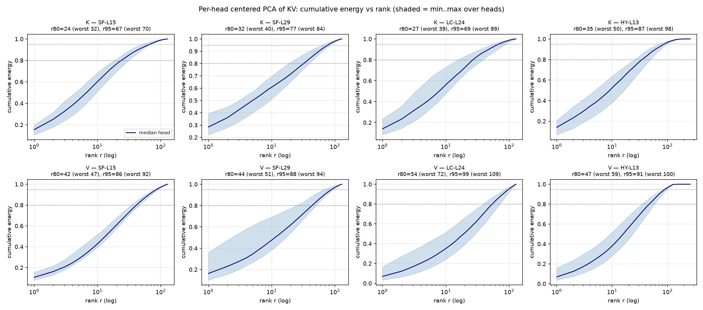
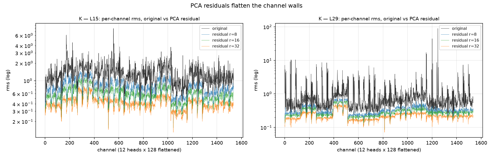
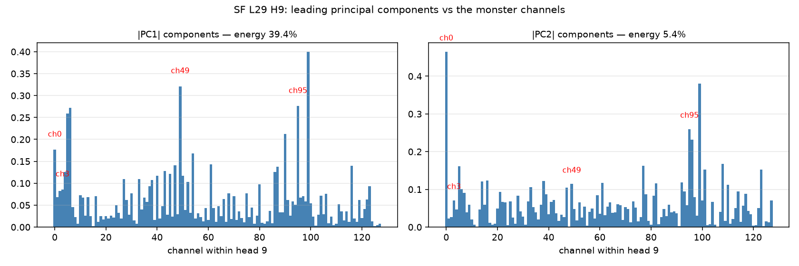

# PCA 谱分析：KV activation 的低秩性实测（Phase 0，纯本地）

计划：[pca-kv-plan.md](pca-kv-plan.md)。数据：SF `sf_qkv.pt`（L15/L29，mid 窗 9,360 token）、
LC `lc_kv.pt`（L24，12,000 token）、HY `hy_kv.pt`（L13，12,000 token，D=256 双分支拼接）。
口径：**per-head、中心化 PCA**（协方差特征分解），能量 = 特征值累积占比。
脚本：`repro/backup/scripts/pca_spectrum.py`。

## 1. 谱衰减：K 是"中低秩"，不是极低秩；V 更弥散

| 数据 | K：r80（中位/最差头） | K：r95 | V：r80 | V：r95 |
|---|---:|---:|---:|---:|
| SF-L15 | **24** / 32 | 67 / 70 | 42 / 47 | 86 / 92 |
| SF-L29 | 32 / 40 | 77 / 84 | 44 / 51 | 88 / 94 |
| LC-L24 | 27 / 39 | 69 / 89 | 54 / 72 | 99 / 109 |
| HY-L13 | 35 / 50 | 87 / 98 | 47 / 59 | 91 / 100 |

读数：**捕获 80% 能量需要 r≈24-35（K）**——比"几根通道墙=秩 2-3"的直觉大一个量级：
墙只是结构的一部分，内容方差本身就占大头。V 一如预判更弥散（r80≈42-54），低秩收益有限。
→ 计划里 r=8 档位只能吸走 ~55% 能量（下方平稳性表印证），"低秩分支吸大头"的原始设想
要修正为"**低秩分支吸墙 + 残差扛大头**"。

## 2. 但机制核心得到强验证：残差被拉得极平

| 层 | 原始 K 通道对比度 | r=8 残差 | r=16 | r=32 | 残差 kurtosis |
|---|---:|---:|---:|---:|---:|
| SF-L15 | 6.4× | **2.2×** | 2.1× | 2.0× | 3.4-3.8（≈高斯） |
| SF-L29 | **149.7×** | **2.6×** | 2.4× | 2.6× | 3.3-3.4 |

**r=8 就把 L29 的 150× 怪物通道墙压到 2.6×**，残差近似各向同性高斯——这正是三元/2bit
量化最喜欢的分布。墙的问题被 8 个主成分几乎完全解决，加大 r 收益趋平。

## 3. H9 专项：主成分确实指向怪物通道，但不"纯"

PC1（39.4% 能量）在 ch49/ch95 上载荷 0.32/0.28——最大的两个方向性成分确实是怪物通道，
但 PC1 同时混合了其他通道（最大其他载荷 0.40），top-8 PC 合计 63.2% 能量。
即 H9 的离群被 PCA 自动吸收 ✓，但它不是"秩 2 现象"。

## 4. 基的平稳性：开头的基用到结尾会漏 10-19%

| r | 结尾窗自己的基 | 用开头窗的基 | 保留率 |
|---|---:|---:|---:|
| 8 | 54.6% | 44.2% | 81% |
| 16 | 71.7% | 61.3% | 85% |
| 32 | 85.5% | 77.0% | 90% |

→ **离线全程共用一套基不可取**；按 chunk 重算（协方差 128×128，微秒级）是正确设计，
与 QVG 每 chunk 重学质心的节奏一致。

## 5. Phase-0 结论与对 Phase 1 的修正

1. **机制成立但故事要改**：PCA 低秩分支的价值不在"吸能量大头"（K 不够低秩），而在
   **专职拆墙**——r=8 花 0.125+ε bit/元素的预算，换来残差从"离群主导"变"高斯"，
   把地狱难度的 2bit 量化变成标准难度。这和 k-means 质心的作用高度同构。
2. **r 档位修正**：r=8 为主力（BPE≈2.30，对打 QVG）；r=16 对照；r=32（BPE≈2.72）
   仅在 r=16 明显吃亏时上。
3. **V 侧预判成立**：V 低秩性差（r80≈50），Phase 1 对 V 建议直接用"均值+残差"（r=0
   或极小 r），预算让给 K。
4. **与 k-means 的对比口径**（Phase 1 关键设计）：token 侧预算 k-means 是 8 bit 索引
   /token/head，PCA r=8@2bit 是 16 bit 系数——同预算应对比 **r=4@2bit 或 r=8@1bit**，
   否则对 PCA 偏袒。
5. 下一步（Phase 1，待确认）：`pca_quant.py` fake-quant 原型，张量级 rel-L2 同 BPE
   对打 k-means 路径与非对称 QuaRot B64。
