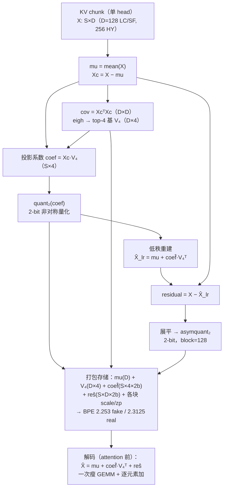

# Report 2026-07-16：PCA-KV N4 方案与三模型评测结果

> 快报：N4 = **LC 首帧三指标全胜（+3.1 dB）/ HY drop 前落败 3.1 dB / SF 打平（含 VBench）**，
> 压缩率始终高于 QVG。评测口径本日全面对齐 paper 并勘误（SSIM 实现、HY 协议、paper 笔误），
> 勘误详情见 §2.1 与 [hy-ref-metrics.md](hy-ref-metrics.md)。

## 一、N4 方案是怎么跑的

**算法**（对 K 和 V 同构，逐 head × 逐 chunk 在线执行，无需校准数据）：

```
X[chunk, head]  ≈  mu  +  quant₂(coef) · V₄ᵀ  +  asymquant₂(residual, block=128)
```

1. 对当前 chunk 内该 head 的 token（LC/SF 头维 128、HY 头维 256）求均值 mu 与协方差，
   `eigh` 取 **top-4 PCA 基 V₄**（在线、逐 chunk，不跨 chunk 复用）；
2. 每 token 4 个投影系数，**2-bit 非对称量化**；
3. 残差展平后 **2-bit 非对称、block=128** 量化。



**账本**：BPE = 2.253（fake 口径）/ 2.3125（真实现含 zero-point）vs QVG INT2 的 2.326
——比特更低。均摊项 = mu + V₄ + 各块 scale/zp。方案由 auto-research 两轮扫出
（r=4>6>8>16、V 侧 PCA +1.2-1.5 dB、非对称残差 >> ternary +1.8 dB，
[../0715/pca-results.md](../0715/pca-results.md)）。

**怎么跑**：fake-quant 注入——`repro/backup/scripts/pca_launcher.py` 在 import 前替换
`quant_videogen.compress.compress_kv_cache`，环境变量 `PCA_R=4 PCA_COEFF_BITS=2
PCA_RES_GRID=asym PCA_V_MODE=pca PCA_RES_BLOCK=128`，宿主命令行照旧（`--quant_type
naive-int2` 被劫持）。**确定性算法**（QVG 的 k-means σ=0.18 dB，N4 单次即精确值）。
现状为 fake-quant（cache 实存 bf16）：质量结论成立，长度/显存/速度故事需 M1-M3
kernel 化（[n4-int2-impl-plan.md](n4-int2-impl-plan.md)）。

**评测口径**（本日定稿，详见 [metric-matrix.md](metric-matrix.md)）：参考 = 同 seed
同配置 BF16；SSIM 一律 paper 的 metric.py 实现（11×11 avg_pool——我们之前的"全局
SSIM"严重虚高，本日勘误，全部数字已重算）；LPIPS 一律 paper 口径（[0,1] 直喂 vgg，
绝对值勿与其他论文横比）。

## 二、LC（LongCat-Video-13B）：首个生成帧，N4 三指标全胜

协议 = **frame 93**（93 帧共享条件视频后的第一个新生成帧，量化误差刚注入、未被
自回归混沌放大）——与 paper Table 1 对齐验证过的口径（0713 报告）。

| 方法（INT2） | PSNR ↑ | SSIM ↑ | LPIPS ↓ | 压缩率 |
|---|---:|---:|---:|---:|
| QVG（我们实测） | 28.73 | 0.9033 | 0.089 | 6.89× |
| QVG（paper Table 1） | 28.716 | 0.909 | 0.065 | 6.94× |
| **N4（我们）** | **31.79** | **0.9424** | **0.067** | **~7.1×**（BPE 2.253） |

- **锚点成立**：我们的 QVG 与 paper **PSNR、SSIM 双双精确 match**（28.73/0.9033 vs
  28.716/0.909）——评测管线可信，N4 的对比在同一杆秤上。
- **N4 +3.06 dB、SSIM +0.039、LPIPS 好 25%**，同时比特更低——LC 上对 QVG 全面胜。
- 对 paper 最强档 QVG-Pro（我们实测 31.04 @4.97×）：N4 PSNR 仍高 0.75 dB，
  压缩率高 43%。

## 三、HY-WorldPlay-8B：两段协议，N4 drop 前落败 3.1 dB

HY 的逐帧误差是**平台 + 断崖**结构：帧 1-28 平台（~35 dB 缓降），帧 29 断崖——恰为
pose `w→s` 首次回访点（需从量化 memory 检索旧内容），量化 run 与 BF16 的内容轨迹
一次性不可逆分岔，崖后 14-18 dB 是"内容已不同"的噪声地板（六段 pose 五个切换点中
仅第一个产生断崖，其余全平）。故协议定稿（0717）：**drop 前 / drop 后分段报 +
断崖帧位置**（断崖 = 首个 PSNR<28 帧）。

| 方法 | 断崖帧 | drop 前 PSNR/SSIM/LPIPS | drop 后 PSNR/SSIM/LPIPS |
|---|:---:|---|---|
| QVG INT2 | 29 | **35.11 / 0.9655 / 0.0544** | 15.79 / 0.370 / 0.432 |
| **N4（INT2）** | 29 | 31.98 / 0.9439 / 0.0770 | 15.62 / 0.380 / 0.435 |
| QVG INT4 | 35 | 35.14 / 0.9640 / 0.0500 | 19.72 / 0.664 / 0.222 |

- **N4 drop 前输 QVG 3.1 dB**（断崖帧相同 = 回访鲁棒性打平；崖后噪声地板打平）。
  早先"HY 打平"结论为跨崖窗口 + 错误 SSIM 的伪影，撤回。
- 差距**不是**调参问题：r=8、128 维半头分裂两个补救 arm 平台均值分毫不动
  （31.98/31.99/31.98，双双证伪）——下一步按层×头×K/V 误差分解定位。
- **paper 对照**：INT4 的 drop 前段与 paper **三指标精确吻合**（35.14/0.964/0.050 vs
  34.454/0.954/0.051）；INT2 的 paper 值（29.174/0.882/0.094）落在两段之间（形状 =
  跨崖平均；paper §5.1 未给 HY 指定协议、官方 bf16/qvg 脚本配置不配对）。已起草
  issue 问作者帧范围（[issue-draft-hy-eval.md](issue-draft-hy-eval.md)）。另证实
  paper §5.2 "chunk 12/16 帧" 为 HY/SF 交叉笔误（代码 HY=16、SF=12，且 12 帧在
  发布代码里结构性跑不通）。

## 四、SF（Self-Forcing-Wan-1.3B）：参考三指标 + VBench 双双打平

**参考三指标**（onset 协议 = 首个量化影响帧；paper Table 1 无 SF 行，此为自建同协议
对比；195 latent = 777 帧匹配配置）：

| 方法（INT2） | PSNR ↑ | SSIM ↑ | LPIPS ↓ |
|---|---:|---:|---:|
| QVG | 38.65 | 0.9736 | 0.041 |
| **N4** | 38.52 | 0.9730 | 0.043 |

起点打平（Δ0.13 dB，噪声级）。

**VBench Image Quality**（逐行复刻官方 imaging_quality，前缀窗口）：

| 方法 | 350f | 700f |
|---|---:|---:|
| BF16 | 72.91 | 71.51 |
| QVG | 72.68 | 70.41 |
| **N4** | 72.32 | 70.26 |

- **协议复现成立**：700f 处 BF16−QVG 相对差 1.10 vs paper 1.04，精确吻合；
- **N4 与 QVG 打平**（同档噪声内）——MUSIQ 无参考、看不见保真度，正确读法是
  N4 的保真收益（LC +3.1 dB）**不付画质税**；
- N4 现受 fake-quant 显存限制止步 777 帧（kernel 化后可测 1400f 长尾）。

## 五、遗留问题（按优先级）

1. **发 issue** 问 HY 帧范围（草稿就绪，作者一句话定 INT2 列复现性）
2. **HY 差距归因**：层×头×K/V 误差分解（调参已证伪）
3. **多 prompt 复验**：全部头条单 prompt/seed；MovieGen 套件 + QVG n≥3
4. **N4 kernel 化** M1-M4；空格：SF×INT4、N4-INT4 档定义
5. W8A8 计划挂起；Weka 集群恢复确认 + 节点赦免

## 附：本日文档索引

[metric-matrix.md](metric-matrix.md) · [hy-ref-metrics.md](hy-ref-metrics.md) ·
[sf-ref-metrics.md](sf-ref-metrics.md) · [ssim-lpips-validation.md](ssim-lpips-validation.md) ·
[vbench-repro.md](vbench-repro.md) · [mse-reduction.md](mse-reduction.md) ·
[kernel-speed.md](kernel-speed.md) · [qvg-evaluation.md](qvg-evaluation.md) ·
[issue-draft-hy-eval.md](issue-draft-hy-eval.md) · [n4-int2-impl-plan.md](n4-int2-impl-plan.md)
