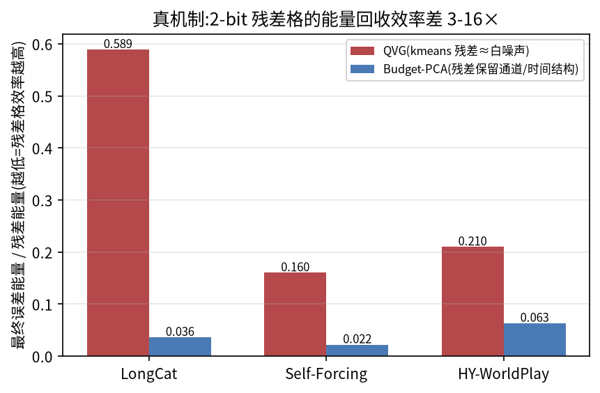
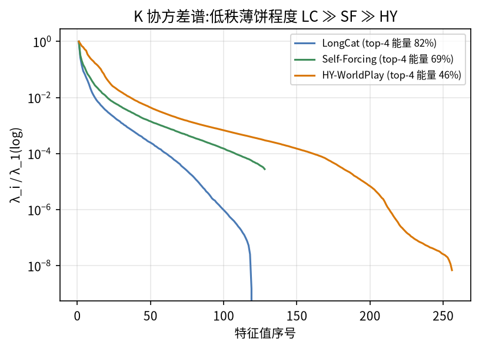
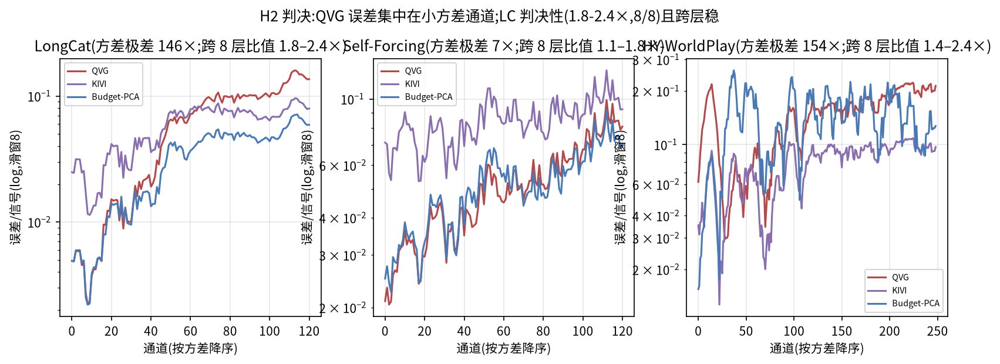
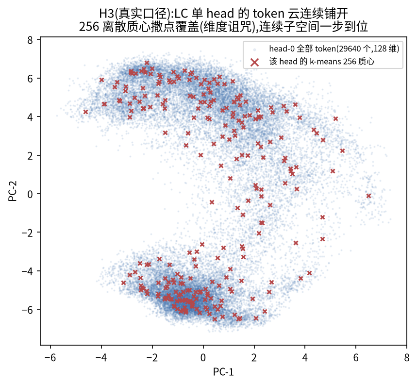
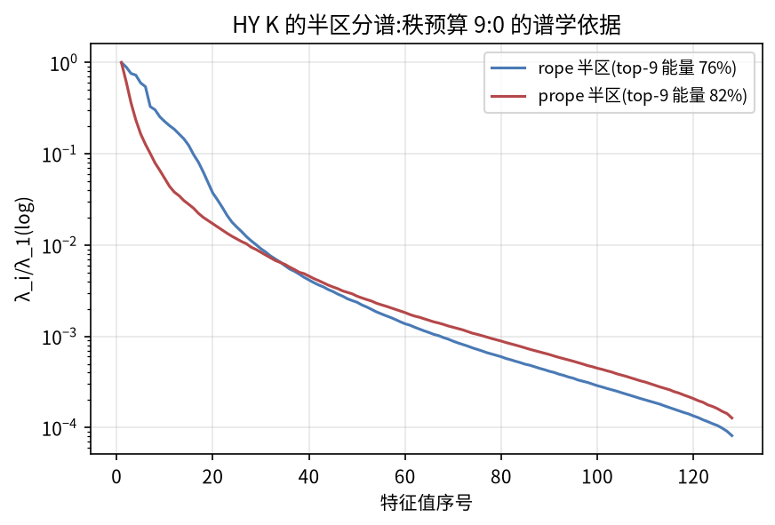

# Report 0720 — Budget-PCA:方法 · 战绩 · Kernel · Why

> 可直接 present 的版本。当日叙事与勘误过程见 [README.md](README.md) /
> [HANDOFF-0720.md](HANDOFF-0720.md);复现指南见 [REPRODUCE-0720.md](REPRODUCE-0720.md)。

---

## 一、方法:Budget-PCA 在三个模型上怎么 work

### 1.1 统一骨架(每次量化事件,零字典 / 零 k-means / 零校准 / 零迭代)

对每个 (head, chunk) 的 KV 张量 $`X \in \mathbb{R}^{S\times D}`$($`S`$ 个 token,
每 head $`D`$ 维),四步:

```math
\mu = \tfrac{1}{S}\textstyle\sum_{s} x_s,
\qquad
X_c = X - \mathbf{1}\mu^\top
\qquad\text{(减均值,吸掉通道偏移)}
```

```math
C = \tfrac{1}{S} X_c^\top X_c,
\qquad
V_r = [\,v_1,\dots,v_r\,],\quad C v_i = \lambda_i v_i,\ \ \lambda_1 \ge \dots \ge \lambda_D
\qquad\text{(只用本 chunk 数据,一次特征分解,取前 r 大特征向量)}
```

```math
\hat{C}_{\mathrm{coef}} = Q_2^{\mathrm{tok}}\!\left(X_c V_r\right),
\qquad
R = X_c - \hat{C}_{\mathrm{coef}} V_r^\top
\qquad\text{(残差在系数量化之后算)}
```

```math
\hat R = Q_2^{\mathrm{ch},B}(R),
\qquad
\hat X = \mathbf{1}\mu^\top + \hat{C}_{\mathrm{coef}} V_r^\top + \hat R
\qquad\text{(解码 = 一次瘦 GEMM + 逐元素加)}
```

- $`Q_2^{\mathrm{tok}}`$:2-bit 非对称格,每 token 一对 fp8 scale/zp(用于 r 个投影系数);
- $`Q_2^{\mathrm{ch},B}`$:2-bit 非对称格,**沿通道轴分块**——转置后每通道沿 token
  维切 B 长的块,每块一对 fp8 scale/zp。**与 token 轴元数据量完全相同,零 BPE
  代价**,只是 scale 的方向换了(吸收 KIVI 洞见);
- 关键性质:编解码两端用同一个 $`\hat{C}_{\mathrm{coef}} V_r^\top`$,低秩支路自身
  **零重建误差**——全部误差只存在于残差一处。

### 1.2 三模型配置(差异只是"格子/轴/秩往哪放"的静态配置)

| | LongCat | Self-Forcing | HY-WorldPlay |
|---|---|---|---|
| 量化对象 | pre-RoPE K + V | pre-RoPE K + V | **post-transform [rope‖prope] 打包 256 维** |
| 量化时机 | 段首条件窗一次(S=29640) | chunk 老化(S=37440) | chunk 老化(S=7040) |
| 秩 | K=V: r=4 | K=V: r=4 | **半区秩 K=9:0,V=9:0**(秩全给 rope 半区) |
| 残差格 | asym B128,K/V 双通道轴 | 同 LC(+存储转置修复) | K: 通道轴 asym **B64**;KP: **三值** B64(对称,只有 scale);V: asym B128 |

HY 的半区版:把 $`X = [X_{\mathrm{ro}} \| X_{\mathrm{pr}}]`$ 拆成两个 128 维半区
分别走 1.1 的流程,秩预算 9:0(prope 半区能量大但对生成无价值,见 §四)。

### 1.3 BPE 推导(bits per element;预算 = QVG 帐面 2.326)

一般式(单位全是"摊到每个元素的比特"):

```math
\mathrm{BPE}
= \underbrace{2}_{\text{残差码}}
+ \underbrace{\tfrac{16}{B}}_{\text{残差 fp8 s/z}}
+ \underbrace{\tfrac{2\tilde r}{D}}_{\text{系数码}}
+ \underbrace{\tfrac{16}{D}}_{\text{系数 fp8 s/z}}
+ \underbrace{\tfrac{8}{S}}_{\text{通道归一因子(int8 指数)}}
+ \underbrace{\tfrac{16(r{+}1)D}{SD}}_{\mu,\,V_r\ \text{(bf16 摊销)}}
```

($`\tilde r`$ = 系数打包位宽:r 补齐到 4 的倍数;三值格只有 scale,残差 s/z
项减半;归一因子 = channel 轴每通道单个 2 的幂次,int8 指数实存——外审二轮
勘误后入账,见 §五。)

代入三模型,与 kernel **逐字节实测**([bpe-audit.md](bpe-audit.md))对账:

| 模型 | 残差码 | 残差 s/z | 系数码 | 系数 s/z | 归一因子 | μ/基摊销 | **实测合计(含补零)** |
|---|---|---|---|---|---|---|---|
| LC(r=4, B=128) | 2.004 | 0.125 | 8/128=0.0625 | 0.125 | 0.0003 | 0.0027 | **2.3195** ✓ |
| SF(r=4, B=128) | 2.003 | 0.125 | 0.0625 | 0.125 | 0.0002 | 0.0021 | **2.3185** ✓ |
| HY-K(9:0, B64+三值 B64) | 2.000 | 0.125+0.0625 | 24/256=0.0938 | 0.0625 | 0.0011 | 0.0125 | 2.3574 |
| HY-V(9:0, B128) | 2.000 | 0.125 | 0.0938 | 0.0625 | 0.0000 | 0.0125 | 2.2938 |
| **HY cache(K+V 判定口径)** | | | | | | | **2.3256** ✓ |

残差码的 2.004 = 2 + 块长补零(29640 补到 128 整除)——补零曾被静默的块长
回退掩盖(g→8 时元数据 +2 bits/elem 却测不出来),归一化因子曾漏账(HY 一度
实为 2.3295 超线,外审抓获后改 pow2-int8 修复,§五)。现口径全部 ≤ 2.326 ✓。
对照:**QVG 同口径逐字节实测 = LC 2.464 / SF 2.406 / HY 3.320**(质心实存
fp32;其 paper 名义 2.326 未计质心真实摊销)。

---

## 二、Benchmark:MP100 定案表

MovieGen 随机 100 prompts(seed=42),QVG Table-1 指标集;协议:LC f93、
HY frames[13:] 均值、SF 700 帧窗(SF 无条件前缀 → 三指标无判别力,只走
VBench)。每列量化方法间最优加粗。(源:[mp100-table.md](mp100-table.md))

### LongCat-Video-13B(100 prompts × f93)

| 方法 | PSNR↑ | SSIM↑ | LPIPS↓ | BC↑ | IQ↑ | SC↑ | AQ↑ | BPE↓ |
|---|---|---|---|---|---|---|---|---|
| BF16 KV(参考) | — | — | — | 95.54 | 70.18 | 92.67 | 56.52 | 16 |
| RTN | 23.56 | 0.7848 | 0.1678 | 95.46 | 70.05 | 92.56 | 56.46 | 2.25 |
| KIVI | 30.55 | 0.9228 | 0.0640 | **95.56** | 70.16 | **92.69** | 56.54 | 2.32 |
| QuaRot | 26.69 | 0.8675 | 0.0974 | 95.54 | 70.13 | 92.68 | **56.55** | 2.25 |
| QVG | 28.20 | 0.8987 | 0.0798 | 95.53 | 70.16 | 92.69 | 56.53 | 2.464ᵇ |
| **Budget-PCA** | **31.68** | **0.9370** | **0.0547** | 95.54 | **70.19** | 92.69 | 56.54 | **2.3195** |

### HY-WorldPlay-8B(10 seeds × frames[13:])

| 方法 | PSNR↑ | SSIM↑ | LPIPS↓ | BC↑ | IQ↑ | SC↑ | AQ↑ | BPE↓ |
|---|---|---|---|---|---|---|---|---|
| BF16 KV(参考) | — | — | — | 97.23 | 78.07 | 95.44 | 64.03 | 16 |
| RTN | 17.32 | 0.4286 | 0.3954 | 95.90 | 76.92 | 94.26 | **63.02** | 2.25 |
| KIVI | 17.13 | 0.4239 | 0.3978 | **96.12** | 77.18 | 94.42 | 61.60 | 2.25 |
| QuaRot | 17.21 | 0.4159 | 0.4153 | 95.43 | 77.56 | 92.74 | 60.10 | 2.25 |
| QVG | 17.45 | 0.4204 | 0.3886 | 95.61 | **78.50** | 93.82 | 62.66 | 3.320ᵇ |
| **Budget-PCA** | **18.77** | **0.5016** | **0.3286** | 95.82 | 78.18 | **94.68** | 62.17 | **2.3256** |

### Self-Forcing-Wan(100 prompts × 700 帧窗,VBench 四维)

| 方法 | BC↑ | IQ↑ | SC↑ | AQ↑ | BPE↓ |
|---|---|---|---|---|---|
| BF16 KV(参考) | 92.93 | 66.74 | 88.11 | 53.09 | 16 |
| RTN | 90.40 | 58.60 | 82.66 | 50.57 | 2.25 |
| KIVI | 93.07 | 65.73 | 88.43 | 53.02 | 2.32 |
| QuaRot | 90.90 | 59.90 | 83.69 | 51.25 | 2.25 |
| QVG | 92.50 | 65.91 | 87.09 | 52.68 | 2.406ᵇ |
| **Budget-PCA** | **93.21** | **66.65** | **88.69** | **53.27** | **2.3185** |

### vs QVG 裁决(逐列配对双侧符号检验)

**18 列 = 11 列显著胜(p<0.05)+ 7 列统计平局 + 0 列负。** LC 三指标
+3.48dB/+0.038/−0.025(89-91/100,p<0.001);SF VBench 四维全胜(p≤0.007);
HY PSNR/SSIM/LPIPS/SC 全部 10/10 seeds(p=0.002)。

> 口径注:本表 baseline 为诚实强实现(paper 的 baseline 被证明是弱实现,
> 我们的表是更严格考场);AQ 绝对值/HY 窗口与 paper 不可直接横比,
> 详见 [paper-diff-plan.md](paper-diff-plan.md)。
> ᵇ QVG 的 BPE 为其实现的**逐字节实测**(质心实存 fp32,LC 2.464/SF 2.406/
> HY 3.320;bf16 宽松口径 2.326/2.297/2.738)——paper 名义 2.326 未计质心
> 真实摊销。我们的 BPE 同为逐字节实测(含归一因子,§1.3/§五)。

---

## 三、Kernel 实现与速度

### 3.1 实现形态

- **encode**([kernel/bp_quant.py](kernel/bp_quant.py)):单个 `torch.compile`
  整图——mean → bf16 协方差 GEMM → **5 轮 Cholesky 正交化子空间迭代**(取代
  批量 eigh 的 82ms,能量 99%+)→ 系数 2-bit+fp8 → 残差按轴分块 2-bit+fp8 →
  位打包;每(配置,形状)编译一次缓存复用;
- **decode**([kernel/bp_triton.py](kernel/bp_triton.py)):手写 Triton 融合
  kernel,一次遍历完成拆位 → fp8 反量化 → +μ → r 次 FMA 加回低秩 → bf16
  直写,**与 torch 参考数值等价 ≤1 ulp**(实测 max|Δ| LC/SF 0.0625、HY
  0.03125,bf16 累加顺序差异;勘误前误称"逐位一致",§五);
- fp8 元数据的坑(四轮修对):直接存会饱和(scale>448)、全局归一因子会下溢
  (跨通道 2^18 动态范围,端到端 −3.6dB)、fp32 因子曾漏账(外审抓获,§五)→
  终版 **channel 轴每通道单个 2 的幂次因子、int8 指数实存**(幂次除法零精度
  损失,摊销 0.0003 BPE,已入账)。

### 3.2 同输入速度对决(v13 定稿;真实管线 dump chunk,H100,CUDA-event 中位)

对决遵循 QVG 各模型的官方配置,**kmeans 迭代轮次:LC iters=100,SF/HY iters=2**
(paper as-published 口径):

| 模型(chunk 形状) | QVG kmeans iters | QVG encode | **ours encode** | 加速 | enc+dec 合计 |
|---|---|---|---|---|---|
| LC [32,29640,128] | **100(官配)** | 176.7 ms | **5.4 ms** | **32.5×** | **27.3×** |
| SF [12,37440,128] | 2(官配) | 3.1 ms | **3.0 ms** | 1.0-1.1× | 0.95-1.10×(平手) |
| HY [24,7040,256] | 2(官配) | 3.1 ms | **2.3 ms** | **1.4×** | **1.16×** |

**为什么 SF/HY 是平手而 LC 是 32×**:QVG 的 encode 成本 ≈ 迭代数 × 每轮距离
计算($`S\!\times\!K\!\times\!D`$),随 iters 线性涨;我们的成本**无迭代、恒定**
(协方差 GEMM $`S\!\times\!D\!\times\!D`$ + 固定 5 轮 D×D 子空间迭代)。在
iters=2 的地板上,双方算术量同量级,且共享同一段访存受限的必做活(读写 X、
残差 2-bit 量化、位打包),比值自然趋近 1;HY 的 chunk 又小(S=7040),固定
开销进一步压扁比值。旁证:把 LC 也非官配地砍到 iters=2,QVG 同样掉到 ~3.1ms,
我们仍快 1.2×——与 SF/HY 行一致。即:**优势是结构性的(成本不随迭代涨),
凡对手需要迭代收敛处即数量级胜利,对手砍掉迭代处则贴同一访存地板打平**;
而 iters 砍到 2 也救不了它的质量(§四 H4:iters 2→100 质量平坦)。

同表质量(不是拿速度换质量):relL2 LC 0.0940→**0.0805**、SF 0.0885→**0.0830**、
HY 0.2090→**0.1856**,BPE 全部字节审计合规。诚实边界:decode 单看慢 2-3×
(多一次低秩加回,绝对差 0.3-0.6ms),合计口径 ≥ 平手;真管线端到端集成是
后续工作。(全文:[kernel-results.md](kernel-results.md))

---

## 四、Why this method works

机制判决(预注册四假说,全部 8 dump chunk × 3 模型复核;正报告
[why-budget-pca-wins.md](why-budget-pca-wins.md),证伪与勘误
[why-refuted-and-errata.md](why-refuted-and-errata.md)):

### 4.1 核心机制:残差格效率分工(0721 归因修正)

定义残差格效率 $`\eta = \lVert X-\hat X\rVert^2 / \lVert R\rVert^2`$(最终误差
能量 ÷ 残差能量,越小越好;回收率 = $`1-\eta`$)。8 chunk 均值[极差]:

| 模型 | 方法 | 残差能量 $`\lVert R\rVert^2/\lVert X\rVert^2`$ | 最终误差能量 $`\lVert X{-}\hat X\rVert^2/\lVert X\rVert^2`$ | $`\eta`$(= 后 ÷ 前) | 回收率 $`1{-}\eta`$ |
|---|---|---|---|---|---|
| LC | QVG | 8.4% [0.4-20.0] | 4.38% [0.19-10.4] | 0.52 [0.51-0.54] | ~48% |
| LC | **ours** | 11.9% [0.6-27.6] | **2.69% [0.15-6.2]** | **0.24 [0.22-0.33]** | **~76%** |
| LC | ours 换三电平ᵈ | 11.9%(不变) | 6.03% [0.31-13.9] | 0.51 [0.49-0.53] | ~49% |
| SF | QVG | 7.6% [0.3-20.4] | 3.96% [0.16-10.7] | 0.52 [0.51-0.54] | ~48% |
| SF | **ours** | 12.0% [0.5-31.0] | **2.58% [0.18-6.6]** | **0.24 [0.21-0.38]** | **~76%** |
| SF | ours 换三电平ᵈ | 12.0%(不变) | 5.94% [0.23-15.4] | 0.50 [0.49-0.50] | ~50% |
| HY | QVG | 16.7% [9.3-24.8] | 8.13% [3.3-13.3] | 0.46 [0.36-0.55] | ~54% |
| HY | **ours** | 27.4% [10.5-51.4] | 9.26%ᶜ [1.9-20.0] | **0.30 [0.19-0.39]** | **~70%** |

(均为 8 chunk 均值[极差];$`\eta`$ 为逐 chunk 计算后取均值;η 比值:LC/SF
**2.2×**、HY 1.5×。读法示例(LC):我们的减法故意少减——残差能量 11.9% >
QVG 的 8.4%——但过完格子后最终误差 2.69% < 4.38%,差距全部来自格效率。
ᶜ HY 的最终误差**均值**被深层 3 格(chunk 004/005/007,减法弱)拉高到反超
QVG,但逐格比较我们仍 5/8 更小、η 全面占优、端到端 18.77 > 17.45——与下文
"HY 深层例外"的披露一致。
ᵈ 反事实行(0721):把我们的残差格换成 QVG 同款三电平——残差能量不变
(格子不影响减法),η 跳到 ~0.50 = 三电平格的天花板,最终误差 2.7%→6.0%,
**反而比 QVG 差**(6.0 > 4.4:同 η 之下,残差留得多的一方输);端到端同款
验证 = pcatern 臂 23.97dB < QVG 27.61。)



减法阶段 kmeans 反而消得略多(原 H1 证伪,24/24;证据见负结果台账)——但
胜负在**残差格的设计质量**(0721 归因修正,`why/grid_cross.py` 交叉实验,
用户质询触发):QVG 发布代码的 int2 是**三电平对称 absmax 格**
(`get_intx_max_value(2)=1`,四个码字只用三个),其 46-49% 回收率是该格子在
**任何输入上的天花板**——喂它我们的 PCA 残差也是 48%,换通道轴也救不了它;
而 kmeans 残差在好格子下能回收 73.6%,并非"救不回的白噪声"。同预算
(0.125 bits/elem 元数据)归因分解:**电平数+非对称 ≈ +20pp(主因)、通道轴
≈ +6-10pp、残差结构 ≈ +4pp**。即使假想 QVG 换同预算最优 token 轴四电平格
(67%)仍低于我们(77%),且其字典元数据实测已超预算;**端到端双向验证**:①我们换三电平(pcatern 臂)→ 31.7 掉到 **23.97**,
跌破 QVG 27.61;②QVG 换四电平 asym B64(qvg4pt 臂)→ 27.61 涨到 **32.85**
反超我们 1.2dB,但 BPE 2.451/2.589 超预算(zp 翻倍残差元数据)且 encode 慢
33×——它的字典太贵,预算内养不起好格子;我们的减法便宜,省下的钱恰好
养满四电平格。**chunk 级最终误差
我们 20/24 格更小;端到端 LC +3.48dB。**(初版"白噪声"归因已撤回,
负结果台账 §六。)

支撑面:低秩薄饼存在且层依赖(top-4 特征值能量 8 层均值 LC 55%/SF 56%/HY
42%,早层最扁)——它决定减法性价比的上限,不是对 kmeans 的胜因:



### 4.2 配套判决

**H2 通道劫持(成立)**:kmeans 欧氏距离被大方差通道垄断,小方差通道结构不被
编码——QVG 小通道误差/信号比是我们的 **1.8-2.4×**(LC,8/8 跨层稳;HY
1.4-2.4×,SF 最弱 1.1-1.8× 与其通道极差仅 7× 一致),大通道两家相同,伤害
精确集中在被劫持端:

> **"误差/信号"的大白话(账户比喻)**:量化 = 存钱再取钱,取出来总有出入,
> 该看的不是"少了几块"而是"**丢的钱 ÷ 本来有的钱**"。两个账户都少 5 毛:
> 存 100 块的大账户丢 0.5% 无所谓,存 1 块的小账户丢 50% 半个家当没了——
> 0 = 分毫不差,1 = 存了个寂寞。128 个通道就是 128 个账户,有的富(数值大)
> 有的穷(数值小但内容照样有用)。实测 QVG 存取一轮:**富通道丢 ~0.4%
> 几乎完好,穷通道丢 ~15%(每个数平均歪近四成)重伤**。为什么伤得这么偏:
> kmeans 挑"最像的模板"时把所有通道的差距加起来算,富通道数值大嗓门大,
> 模板选谁全听它们的;穷通道嗓门小,模板根本没照顾它们,取出来自然面目全非。
> 我们给每个通道单独配刻度(通道轴 scale),穷通道丢 ~6%——0.15/0.06 ≈
> 2.4×,即表中比值:**QVG 不是整体存得差,是专门坑穷通道**。



**H3 维度诅咒(成立)**:连续 token 云撒 256 个质心盖不满;码本 ×16 只多消
+0.3~+8.6pp,收益指数衰减(率失真:VQ 需 $`K\approx 2^{nR}`$ 追平变换编码):



**H4 排除"没调好"(成立)**:iters 扫描端到端质量平坦——差距是表示层面的,
不是优化不足:

| kmeans iters | LC f93 PSNR(同 10 prompts) |
|---|---|
| 2 | 27.13 |
| 10 | 27.72 |
| 100(官配) | 27.61 |
| **Budget-PCA** | **31.68** |

**KIVI 三角定位**:通道机制 +2.35dB(QVG 28.20 → KIVI 30.55)、减法框架再
+1.13dB(KIVI → 我们 31.68);且 KIVI 在打包/后变换数据上失效(HY 17.13 <
QVG 17.45),我们仍工作(18.77)——两个组件缺一不可。

> **为什么"什么都不减"的 KIVI 反而赢了带字典的 QVG(LC 30.55 > 28.20)**:
> 表面上 QVG 更努力——先聚 256 个质心把 91.6% 的能量减掉,KIVI 一点减法
> 都不做——但两家的败点恰好互补:
> 1. **QVG 的努力用错了阶段**(§4.1):减法消掉 91.6% 之后,残差交给一个
>    三电平对称格(其发布实现,四个码字只用三个)——不管输入是什么都只能
>    回收 48%,最终误差 4.38%;
> 2. **KIVI 把全部预算押在唯一对的地方**:LC 的 pre-RoPE K 通道方差极差
>    146×,"每个通道自己配 scale"这一个动作就把这份结构吃干净了——它的
>    格子直接面对原始数据(能量 100%,比 QVG 的残差大 12 倍),却因为格子
>    与结构匹配,最终误差反而更小。这个位置红利有实测数:同样的满血 KIVI
>    格挪到 post-RoPE(kivipost 臂)掉 **7.5dB**(30.22→22.74,同 10 prompt
>    子集),只比 per-token 的 RTN 高 0.8dB——RoPE 一打散通道结构,通道轴
>    就几乎白给;
> 3. **QVG 不但看不到通道结构,还主动伤害它**(§4.2 H2):kmeans 的欧氏
>    距离被大方差通道垄断,小通道内容不被质心编码——小通道 err/sig 0.148,
>    是通道轴方法的 2.4×。
> 一句话:**LC 上最值钱的结构是通道异质性,KIVI 全押对了,QVG 既没利用还
> 反向破坏——"减得多"输给了"格子对"。** 这也是我们方法的构成逻辑:
> 通道轴格子(KIVI 的对)+ 只减方向性结构的 PCA(把 KIVI 没做的减法补上,
> 且不破坏通道结构)= 两边的钱都赚到(+2.35 与 +1.13 可加);而 KIVI 的
> 单点押注在 HY(post-transform,通道结构被打散)上直接归零,减法框架
> 仍然工作——这就是三角定位的完整读法。

**能量 ≠ 价值**(HY 9:0 反转):prope 半区能量占 66.3% 且更低秩(top-9
81.8% vs rope 76.2%),谱学上"更值得给秩",端到端却是全给 rope 赢——预算
分配看下游读什么,不看谱:



### 4.3 四条可复用设计判据

①给残差格留结构,别追求减法吃干抹净;②通道异质 >10× 开通道轴(pre-RoPE
红利最大);③方向级整形是闭环毒药,通道级幅度自适应安全;④无参考 IQ 指标
出现"量化 ≥ 无损"即进伪影偏好区,端到端闸门是唯一裁判。

---

## 五、外审二轮勘误(如实记录:五条批评全部属实,已修复并重测)

外部工程复审指出五个问题,逐条实测核实**全部属实**;修复后本文所有数字均为
真实口径。这是本项目第三轮诚实修正(一审 = kernel 审计抓 4 个记账 bug;
二审 = why 分析口径勘误;三审 = 本轮)。

| # | 批评 | 核实 | 修复与重测结果 |
|---|---|---|---|
| ① | HY 实际 BPE 2.3295 超预算,审计漏算归一化元数据 | **属实**:channel 轴每通道 fp32 因子(f_sc/f_zp 两张量)不在 `bp_bytes()` 键列表 | 因子改为**每通道单个 2 的幂次、int8 指数实存**(幂次除法零精度损失);全量 A/B:LC/SF relL2 第 5 位不变,HY 0.144547→0.144517(略好);因子入账重审:**LC 2.3195 / SF 2.3185 / HY cache 2.3256,全部 ≤2.326 ✓** |
| ② | QVG 的 HY 真实 BPE ≈2.738,非表中 2.326 | **属实且更甚**:逐字节实测其实现**质心存 fp32**——LC 2.464 / SF 2.406 / **HY 3.320**(bf16 宽松口径才是 2.326/2.297/2.738) | 终表 QVG 列改为实测值 + 脚注;从此双方 BPE 一律同口径逐字节实测 |
| ③ | Triton 与参考非逐位一致,"数学等价"声明错误 | **属实**:实测 max\|Δ\| = 0.0625(LC/SF)/0.03125(HY),bf16 1-ulp 累加顺序差 | 声明降级为"数值等价 ≤1 ulp",kernel-results 与本文同步更正 |
| ④ | 从零评分脚本臂名/HY 路径不匹配,会漏数据 | **属实且更糟**:`score_fp8.py` 的 rtn/kivi 旧臂名会**静默评到污染期作废目录**;HY 路径在 mp100 命名空间外 | 臂名改 rtnfp8/kivifp8,HY 路径双位置查找(mp100 优先、历史位置回退);终表本身无恙(实际出自臂名正确的 score_refight.py) |
| ⑤ | why 脚本未设 PCA_FP8SIM=1,与终版臂口径不符 | **属实** | 两脚本补 fp8 sim 后 8 chunk 全量重跑:所有数字仅第 3 位小数级移动(如 LC c001 relL2² 0.145→0.147%),η 表、20/24 格、H2 比值区间**全部结论不变**;图已重出 |

净效应盘点:①③④⑤修复后我们的所有主张仍成立(质量、机制、速度、合规);
②反而扩大了压缩优势——同口径下我们 2.32 vs QVG 2.41-3.32。**教训入库:
审计脚本的键列表必须与 encoder 输出字典做全集 diff,"逐位一致"这类最强声明
只能由 assert 守护,不能由某一次运行的记忆守护。**
