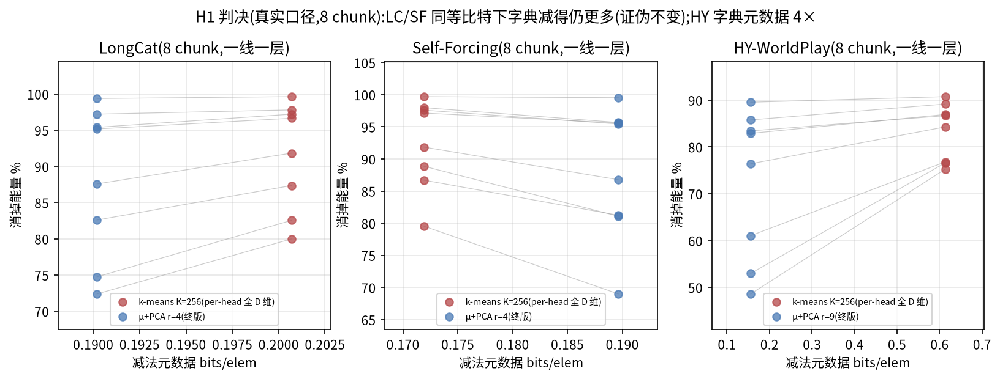

# Why 分析:证伪、撤回与勘误记录(负结果台账)

> 本文收录 [why-budget-pca-wins.md](why-budget-pca-wins.md) 判决过程中**被证伪的
> 原命题、被撤回/降级的论断、以及外部核查触发的勘误**。正报告只保留成立的假说;
> 但负结果同样是预注册判决的一部分——它们决定了正报告的机制结论长什么样,
> 引用正报告时应连同本文一起看。数据与脚本同源(`why/h1_h2_data.npz`、`why/*.py`)。

## 一、H1 原命题:证伪

**原预测(预注册)**:同等元数据比特下,rank-r 子空间消掉的能量 ≫ 256 质心字典。

**判决:证伪**(真口径:per-head 全 D 维聚类,与 eval 完全同配置)。同等元数据
(LC/SF:~0.2 bits/elem 对 ~0.19)下,kmeans K=256 在**全部 8 个 chunk 上**比
μ+PCA r=4 消得多:

| 模型 | kmeans K=256 消掉能量(8 层均值[极差]) | μ+PCA 终版 | 方向 |
|---|---|---|---|
| LC | 91.6% [80.0-99.6] | 88.1% [72.4-99.4] | kmeans 多,8/8 |
| SF | 92.4% [79.5-99.7] | 88.0% [69.0-99.5] | kmeans 多,8/8 |
| HY | 83.3% [75.2-90.8] | 72.6% [48.6-89.5] | kmeans 多,8/8(注) |

注(HY):字典消得虽多,但其质心元数据是我们的 ~4×(0.61 vs 0.15 bits/elem
——短 chunk S=7040 摊不薄 256×256 质心表),per-bit 反而我们高;这不改变
"字典减法不弱"的证伪结论,只说明 HY 上字典的账面代价更重。

**证伪的意义**:它排除了"我们赢在减法阶段"的最顺手解释,把胜因逼到了残差
阶段——由此导出的"残差结构分工"修正命题(kmeans 残差≈白噪声、格子回收率
钉死 46-49% vs 我们 ~76%)是正报告 §一的主结论。**没有这次证伪就没有正确的
机制结论。**

## 二、撤回与降级的论断

1. **fig1 的"低秩薄饼程度 LC ≫ SF ≫ HY"排序:撤回**。单 chunk(chunk_001:
   82/70/47%)成立,但 8 层复核后均值 LC 55% ≈ SF 56%(极差 36-82 vs 40-86),
   chunk_000 上甚至 SF>LC——跨模型排序不稳,是层依赖现象的过度概括。
   "低秩薄饼存在且层依赖"本身仍成立(正报告 §一保留);
2. **H2 的"SF 均质 → 通道机制无红利 → 反向验证":降级为部分成立**。
   "无红利"只在 chunk_001(1.13×)成立,深层拉开到 1.8×(8 层 1.1-1.8×,
   均值 1.5×)。方向没错——SF 的通道劫持效应确实是三模型最弱(与其通道方差
   极差仅 7× 一致)——但"≈ 无差别"的表述过强。

## 三、外部核查触发的三处勘误(0720 二审)

外部核查(GPT 复核)指出三处问题,逐条核实后**全部属实**,已在正报告修正:

1. **聚类口径错误(最重要)**:旧版 kmeans 侧脚本(`why/h1_kmeans_sub.py`,
   已废弃留痕)把所有 head 的 64 维块拼成一池做全局聚类;QVG 真实实现
   (`quant_videogen/functions.py::prq_quantize_tensor`)是 **per-head、
   全 D 维 token 聚类**(centroids (B,H,K,D)、ids (B,H,S)),`block_size=64`
   只作用于残差量化。fig2/3/5 与相关数字全部按真口径重算
   (`why/h1_real_path.py`/`h1_ours_path.py`)。修正后 H1 证伪结论不变且更稳
   (8 chunk × 3 模型 = 24/24 全向);
2. **残差格效率差 16×/7×/3× → 2.2×/2.2×/1.5×**:旧数系分子用视频级 relL2²、
   分母用错误聚类口径的 chunk 级能量——两头口径不一致的自欺账。修正为同
   chunk 内自洽口径后幅度回落,但机制签名反而更硬(QVG 回收率 16 个 LC/SF
   测点全部钉死在白噪声理论值 46-49%);
3. **"K:64→1024 只多消掉 0.7%" 引用错误**:64→1024 的真实增量是 +0.3pp
   (chunk_001)到 +8.6pp(chunk_007);旧句把 256→1024 的增量错标到 64→1024。

另:单 chunk 数字全面改为 8 chunk 复核后,新增 4 个"chunk 级最终误差我们更差"
的格(SF chunk_000 + HY 深层 004/005/007),已如实写入正报告 §一(端到端 HY
仍赢,与"能量≠价值"一致)。外部核查报的 8 层谱均值(55.5/56.3/40.6)与我们
复算(55/56/42)交叉验证一致。

## 四、更早的相关证伪(索引)

与本判决同一理论脉络、在更早日期被证伪的方案(避免后人重走):

- **方向级误差整形/旋转全家**(0717-0718 反复证伪):PCA 潜空间拉伸、方向
  加权、旋转对齐等一切"改坐标系"的操作都在端到端闸门溃败——通道级幅度
  自适应安全,方向级整形是闭环毒药(正报告判据 3);
- **HY 通道 σ 归一(chnorm)**(0719 证伪,16.95 vs 基线 17.54):post-transform
  数据的通道方差是位置混合的,归一化有害;channel 轴才是 HY 正解;
- **"无固定读出坐标系"理论**(0717 证伪):三管线 as-evaluated 坐标系全固定;
  各向异性失败的经验规律仍在,机制开放;
- **N12 字典版方法**:被"无 k-means"约束退役,其 SF 读数已勘误作废
  (正版=N19/Budget-PCA 终版)。

## 复现

数据与命令与正报告"复现方法"一节完全相同(①-④ 同一批脚本产出正负两份
结论);fig2 由 `why/make_figs.py` 生成。核对点:上表 §一 的消掉能量数字
(kmeans 随机性 ±1pp)。

## 五、三审补记(0720 外部工程复审,与本台账相关的一条)

外审五条批评之⑤:`h1_ours_path.py`/`h2_multichunk.py` 未设 `PCA_FP8SIM=1`,
与终版臂(全带 fp8 后缀)口径不符——**属实**。补上后 8 chunk 全量重跑,
全部数字仅第 3 位小数级移动(如 LC chunk_001 relL2² 0.145→0.147%、回收率
76.8→76.6%),η 表、20/24 格、H2 比值区间结论不变;正报告与图已同步。
其余四条(HY BPE 漏账、QVG 真实 BPE、Triton ulp、评分脚本路径)属工程侧,
全记录见 report-0720 §五。

## 六、四审:"白噪声机制"归因撤回(0721,用户质询触发)

**被撤回的论断**(初版 §一 机制叙事):"kmeans 残差≈各向同性白噪声,minmax
均匀 2-bit 格在白噪声上就是教科书的 ~50% 损失;我们的残差保留通道结构,所以
格子救得回来"——即把 η 差距(0.52 vs 0.24)归因于**残差的结构差异**。

**质询**:"是不是只是因为我们用了 int2 的四个点位,QVG 只用了三个?"

**核实:质询方向正确,且揭出一个此前漏查的代码事实**——QVG 发布代码的 int2
量化器(`sim/quant/lowbit_quantize.py::get_intx_max_value(2)=1`)本来就是
**三电平对称 absmax 格**({−1,0,+1}×scale,四个码字只用三个),不仅是 paper
baseline,其自己方法的残差格也是。交叉实验(`why/grid_cross.py`,
{两种残差}×{3/4 电平 × token/通道轴},全部同预算 0.125 bits/elem,8 chunk)
判决:

1. **46-49% 是三电平格的输入无关天花板**:喂它我们的 PCA 残差同样 47.5-47.7%,
   换通道轴也只有 47.5-50.1%——"钉死"的签名属于格子,不属于白噪声;
2. **kmeans 残差不是救不回的白噪声**:四电平通道轴格在它上面回收 72-74%;
3. **归因分解**:电平数+非对称 ≈ +20pp(主因)、通道轴 ≈ +6-10pp、残差结构
   ≈ +4pp(只在通道轴上表达)。

**端到端验证**(pcaternkaxvaxfp8 臂,LC 10 prompts,f93):把 Budget-PCA
的残差格换成同款三电平,PSNR 从 ~31.7 掉到 **23.97**(−7.7dB),并**跌破
QVG 的 27.61**——同样用三电平格时,减法更强的 kmeans 反而赢,与 chunk 级
预测(最终误差 ≈ 残差能量 × 常数 0.52)完全一致:整体胜利确实来自格子,
不来自残差结构。

**反向反事实**(qvg4pt 臂):给 QVG 的 kmeans 减法配四电平 asym B64 残差格
(减法不动)→ 27.61 涨到 **32.85(⚠0721 勘误中:此数系 qvg4pt 臂漏设 fp8 元数据模拟的口径,scale/zp 实为 fp32、真实 BPE ~2.84;fp8 合法口径复测进行中,完成后更新)**(超我们 1.2dB),但 BPE 2.589(实存)超
预算 11%、encode 慢 33×——确认减法本身更强,只是预算内养不起好格子。

**修正后的机制**:"残差结构分工" → **"残差格效率分工"**——胜负手是同预算
下的格子设计质量(码字用满 + 非对称 + 对轴),残差结构降级为 +4pp 次要因子;
正报告 §〇/§一、判据①已同步改写。η 表的实测数字不变(它量的是两条管线
as-released 的真实表现),变的是"为什么差"的解释。

连带说明:此事实同时把 paper-diff 的"三点位格"假说从 E1 推断升级为**代码级
实锤**(其发布仓库的共享 int2 量化器就是三电平)。

## 七、五审:"合同内无合法 kmeans 变体"论断部分撤回(0721 夜,用户驱动实测)

用户坚持实跑名义口径的最强 kmeans 变体(qvgprot:BF16 质心 + 四电平 asym
token 轴 B128,名义 BPE 2.3257 压线合法;fp8 元数据 + 全局归一因子,与我们
同规记账)。**结果:LC 10 prompts f93 = 32.80dB,超我们(31.7)1.1dB。**
此前"按实存记账 kmeans 无合同内成员、合法预算点 Pareto 前沿无条件是我们"
的卖点表述**部分撤回**:它只对 as-released 口径成立;名义口径下存在质量更高
的合法 kmeans 变体(代价:每次量化 33× 编码延迟;HY 名义 2.738 仍无解)。
过程另有一处自查勘误:qvgpro/qvg4 臂首轮漏设 PCA_FP8SIM(scale/zp 以 fp32
生成,首测 33.28/32.85 为超预算口径),修复重跑后 qvgprot 32.80 为合法口径
终值;qvg4pt fp8 复测排队中。sell-budget-pca.md 已按四元组(质量-速度-预算-
三模型)重写定位。
