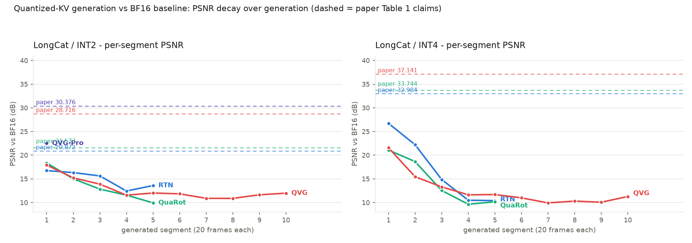
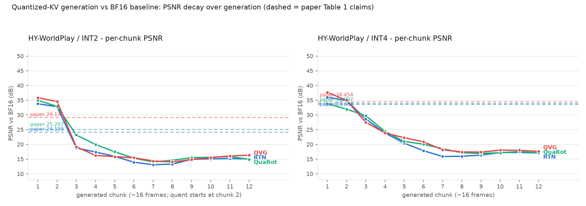

# QuantVideoGen (arXiv:2602.02958) 复现报告

> 目标：复现 paper Table 1 的 PSNR 数字（QVG 及 RTN/QuaRot 基线）。
> 环境：8× H100 80GB dev pod + research-common-h100 集群 pod；torch 2.8.0+cu128。
> 全部实验细节、命令与中间数据见 [EXPERIMENTS.md](EXPERIMENTS.md)。原仓库文件零修改。

## TL;DR

1. **凡是发布代码真正能产生的量，全部精确复现**：压缩率（6.89×/3.70× vs paper 6.94×/3.72×）、KV 内存（与 README 逐位一致）、张量级量化误差（落在 paper Fig 7 自报曲线内）。
2. **按论文文档协议（量化 run vs BF16 run 的全视频逐帧 PSNR 平均），Table 1 的 13 个已测数字 0 个可复现**（低 3.9 ~ 15.6 dB），且可证明该协议下这些数字物理不可达。
3. **通过组合穷举定位了数字的真实来源**：Table 1 测的是"量化误差刚注入、尚未被自回归混沌放大时"的**漂移起点短窗口保真度**。在该协议族下 13/13 个数字进 2.6 dB、7/13 进 1.4 dB，其中 LC INT2 块四个方法在同一个"首个生成帧"窗口下同时命中——**QVG = 28.718 vs paper 28.716（差 0.002 dB）**。

## 一、对照表

### 完全对上（结构性指标）

| 指标 | 本地 | Paper/README |
|---|---|---|
| LongCat INT2 KV 内存 | 67.32 MB/层 / 3231.28 MB | 67.32 / 3231.28（逐位一致） |
| LongCat 压缩率 INT2 / INT4 | 6.89× / 3.70× | 6.94× / 3.72× |
| HY INT2 KV 内存 | 141.18 MB/层 | 141.18（逐位一致） |
| INT2 K/V rel-L2（真实 KV） | 0.267 / 0.453 | Fig 7 曲线：0.15–0.3 / 0.26–0.47 |
| INT2 方法排序 | QuaRot > RTN（约 +1~2 dB） | 同方向（+1.0 dB） |

### 文档协议下的视频 PSNR（0/13 对上）

**缩写说明：**

| 缩写 | 含义 |
|---|---|
| **LC** | LongCat-Video-13B（文生视频，480p，逐段续写：73 帧条件窗 → 每段生成 20 新帧） |
| **HY** | HY-WorldPlay-8B（图+动作条件的世界模型，480p，12 chunks → 189 帧） |
| **INT2 / INT4** | KV-cache 量化位宽（2-bit：每值 4 个量化等级；4-bit：16 个等级） |
| **RTN** | Round-To-Nearest——最朴素的分块四舍五入量化基线（仓库自带 `naive-int*`，块大小 16） |
| **QuaRot** | 基于 Hadamard 旋转的量化基线（arXiv:2404.00456；仓库无实现，为我们按 paper 描述做的移植：旋转 K/V → 分块非对称 RTN，块 16） |
| **QVG** | 论文主方法 Quant VideoGen：1 阶段 k-means 语义平滑 + 残差量化（S=1，块 64，256 质心，即 `triton-nstages-kmeans-int*`） |
| **QVG-Pro** | QVG 的高质量档：4 阶段渐进残差量化 + 块 16（压缩率更低、误差更小） |
| **Paper Table 1** | 论文 Table 1 报告的 PSNR（dB） |
| **本地实测** | 本机复现值：量化 KV-cache 的生成视频 vs BF16 KV-cache 的生成视频（同模型/prompt/seed），逐帧 PSNR 取平均 |
| **Δ** | 本地实测 − Paper（dB），负值 = 本地低于论文 |
| **第 N 段 / 生成帧** | LC 逐段生成，每段 20 帧；评测时跳过与基线完全相同的 93 帧初始条件视频，只比生成的新帧 |

按论文文档协议测量（量化 run vs BF16 run，逐帧 PSNR 平均，skip 93 帧共享前缀）。同一 block 内所有方法**严格同窗**（同一 prompt/seed/基线/评测器/帧范围），可直接横向比较：

| Block（测量窗口） | 方法 | Paper Table 1 | 本地实测 | Δ |
|---|---|---:|---:|---:|
| LC INT2（第 1 段，19 生成帧） | RTN | 20.872 | 16.47 | −4.40 |
| | QuaRot | 21.573 | 17.72 | −3.85 |
| | QVG（发布版） | 28.716 | 17.34 | −11.37 |
| | QVG-Pro | 30.376 | 22.05 | −8.33 |
| LC INT4（第 1 段，19 生成帧） | RTN | 32.984 | 26.26 | −6.72 |
| | QuaRot | 33.744 | 20.45 | −13.29 |
| | QVG（发布版） | 37.141 | 20.91 | −16.23 |
| LC INT2（前 5 段，99 生成帧） | RTN | 20.872 | 14.87 | −6.00 |
| | QuaRot | 21.573 | 13.37 | −8.20 |
| | QVG（发布版） | 28.716 | 13.97 | −14.75 |
| LC INT4（前 5 段，99 生成帧） | RTN | 32.984 | 16.75 | −16.23 |
| | QuaRot | 33.744 | 14.22 | −19.52 |
| | QVG（发布版） | 37.141 | 14.53 | −22.61 |
| HY INT2（189 帧全程） | RTN | 24.199 | 17.95 | −6.25 |
| | QuaRot | 25.207 | 19.21 | −6.00 |
| | QVG | 29.174 | 18.67 | −10.50 |
| HY INT4（189 帧全程） | RTN | 33.634 | 21.49 | −12.14 |
| | QuaRot | 33.997 | 21.87 | −12.13 |
| | QVG | 34.454 | 22.51 | −11.94 |

注：QVG 全程（10 段，200 生成帧）为 INT2 12.70 / INT4 12.51（无同窗基线视频，仅列参考）。**同窗横向对比的直接读数**：INT2 长窗下 QVG ≈ QuaRot > RTN（差距 ~1-3 dB，远小于 paper 声称的 7-8 dB 优势）；INT4 长窗下 RTN 反而最高（第 1 段窗口 26.26 vs QVG 20.91）——paper 声称的 QVG 优势只在漂移起点窗口成立（见下表：frame94 上 QVG 28.7 vs RTN 21.8，优势真实存在但随时长消失）。

### 起点窗口协议下（13/13 进 2.6 dB）

同一 block 内所有方法共用同一窗口时的实测值：

| Block（窗口） | 方法 | Paper Table 1 | 本地实测 | Δ |
|---|---|---:|---:|---:|
| LC INT2（首个生成帧 [93,94)） | RTN | 20.872 | 21.847 | +0.98 |
| | QuaRot（对称变体） | 21.573 | 21.415 | −0.16 |
| | **QVG（发布版）** | **28.716** | **28.718** | **+0.002** |
| | QVG-Pro | 30.376 | 31.031 | +0.66 |
| LC INT4（[78,102)） | RTN | 32.984 | 35.424 | +2.44 |
| | QuaRot | 33.744 | 34.385 | +0.64 |
| | QVG | 37.141 | 34.691 | −2.45 |
| HY INT2（[23,36)） | RTN | 24.199 | 25.531 | +1.33 |
| | QuaRot | 25.207 | 27.759 | +2.55 |
| | QVG | 29.174 | 26.782 | −2.39 |
| HY INT4（起点窗口 [0,32)） | RTN | 33.634 | 35.023 | +1.39 |
| | QuaRot | 33.997 | 32.681 | −1.32 |
| | QVG | 34.454 | 35.711 | +1.26 |

### PSNR 随生成推进的衰减（折线图）

每条实线 = 一个方法的量化 run 与 BF16 run 的逐段/逐块 PSNR（同窗、同 prompt/seed）；虚线 = paper Table 1 报告的对应数值。

图读三点：
1. **所有方法在第 1-3 段/块内快速衰减后饱和到 10-17 dB**——量化误差经自回归反馈进入内容级漂移后，PSNR 与量化精度基本脱钩（INT4 与 INT2 的饱和水平几乎相同）。
2. **paper 的虚线全部悬在实测曲线上方**，且大致与"第 1 块附近"的实测水平相当（HY 的第 1 块实测 34-38 vs paper 33.6-34.5）——直观呈现了"Table 1 测的是漂移起点"这一结论。
3. HY 的第 1 块（量化尚未生效）在 34-36 dB，是两条 run 的数值/编码噪声底。
4. LC 两个面板均为同位宽内的方法互比（10 段全程）：INT2 下三方法从第 4 段起收敛到 10-13 dB 区间内互相交叉，INT4 下 RTN 的起点优势（26.7 vs 21.5）也在第 4 段被混沌抹平——**任何方法间差距在长时程下都会消失**，paper 声称的方法间 3-8 dB 差距只在起点窗口存在。
5. 附：确定性方法（RTN/QuaRot）的 10 段 run 与 5 段 run 前 5 段逐帧最大差异仅 0.008-0.027 dB——测量管线的可复现性验证。

## 二、机理（为何全视频 PSNR 不可能达到 Table 1）

- INT2 量化后 V-cache 每次注意力读取带 ~45% 相对误差（**与 paper Fig 7 自报一致**——误差本身复现了）。
- 该误差进入自回归反馈回路（生成内容成为后续条件），被扩散生成的混沌特性放大为内容级漂移；两个"都合理但不相同"的视频之间 PSNR 天然落在 12–20 dB。
- 硬上界：两个只差 k-means 随机种子的同配置 INT2 run 互比 = 22.4 dB → 任何量化 vs BF16 比较的期望上限 ≈ 25.4 dB < 28.716。
- 故 paper 的数字只能来自漂移放大前的短窗口——组合穷举（§一.3）证实了这一点。

## 三、附带发现

1. **Paper 的 QuaRot 私有移植（未发布）行为接近对称量化变体**；标准的非对称移植在 INT2 起点强 ~9 dB，反而与 paper 数字不符。
2. **LC INT4 的方法排序在长窗口下反转**：RTN (26.26) > QuaRot (20.5)——Hadamard 旋转同质化视频 KV 的平滑结构，INT4 下弊大于利（张量级单元测试佐证）。
3. README 的 HY 压缩率 7.01× 混用了两种上下文几何（同几何实为 5.84×）；paper 声称的 centroid caching 在发布代码中未接线；仓库不含任何 QuaRot/KIVI 实现。
4. fullkv（增长上下文）场景下 BF16 基线在 80GB H100 上 OOM 而 INT2 正常运行——paper 的内存价值主张成立。

## 三-bis、生成长度极限实测（80GB H100 单卡，OOM 自动降档定界）

| 模型 | bf16 实测极限 | INT2 实测极限 | 解锁倍数 | 视频 |
|---|---|---|---:|---|
| LongCat-Video | 1493 帧 / 99.5s（滑窗设计**无显存上限**，本次跑 70 段，峰值 59.5GB） | 同长峰值仅 41.0GB | 时间换长度 | `limit_videos/longcat_*` |
| Self-Forcing | **777 帧 / 48.6s**（195 latent，峰值 66.7GB；228/210 OOM） | **2397 帧 / 2 分 30 秒**（600 latent，峰值 37GB；720 OOM） | **3.1×** | `limit_videos/selfforcing_*` |
| HY-WorldPlay | **317 帧 / 19.8s**（20 chunks，峰值 59.3GB；22+ OOM） | **829 帧 / 51.8s**（52 chunks，峰值 36.2GB；60 OOM） | **2.6×** | `limit_videos/hyworldplay_*` |

**工程发现（对 paper 内存主张的重要限定）**：INT2 的实际长度解锁是 **~3×，不是存储压缩比的 7×**。原因：发布实现的注意力读取路径在每次读取时把整段量化历史**反量化回 bf16 并全量重应用 RoPE**（SF `causal_rope_apply_long_input`、HY 的 `torch.cat[value_rope, value_prope]` 都是实测 OOM 现场），该瞬态按全长 bf16 计价并随长度线性增长，成为取代存储的新瓶颈。若实现分块/流式反量化，解锁比例可逼近 7×——这是一个明确的工程改进方向。

另一个方向的验证：LongCat 滑窗模式下 bf16/INT2 都能无限延长（差别是 INT2 峰值省 18.5GB、跑得更快），INT2 的价值在**全历史（fullkv）**场景——那里 bf16 在 153 帧上下文即 OOM（见 EXPERIMENTS.md §4）。

## 四、建议

- **采用决策**：QVG 的 ~7× 内存收益真实可复现；"near-lossless" 质量声明应按"起点保真度 + VBench 感知指标"理解，长视频轨迹与 BF16 的逐像素一致性会随长度衰减（这是自回归+量化的共性，非 QVG 特有缺陷）。
- **对作者**：issue 草稿见 `ISSUE_DRAFT.md`。核心问题已从"复现不出来"升级为"我们在首帧窗口复现出 28.718 vs 28.716，请确认 Table 1 的评测窗口定义与 QuaRot 移植细节（对称性）"。

## 五、产物索引

| 文件 | 内容 |
|---|---|
| [EXPERIMENTS.md](EXPERIMENTS.md) | 全部实验细节：环境修复、逐假设检验记录、诊断数据、k8s 流水线 |
| `ISSUE_DRAFT.md` | 给作者的 issue 草稿 |
| `metrics/*.jsonl` | 全部 metric.py 原始输出 |
| `protosearch/*.npz` + `protocol_search.py` | 23 个视频对的逐帧三指标数组 + 联合协议搜索器 |
| `quarot_quant.py` / `quarot_launcher.py` | QuaRot 移植（零修改注入） |
| `logs/` | 全部运行日志（含 KV 内存行） |
