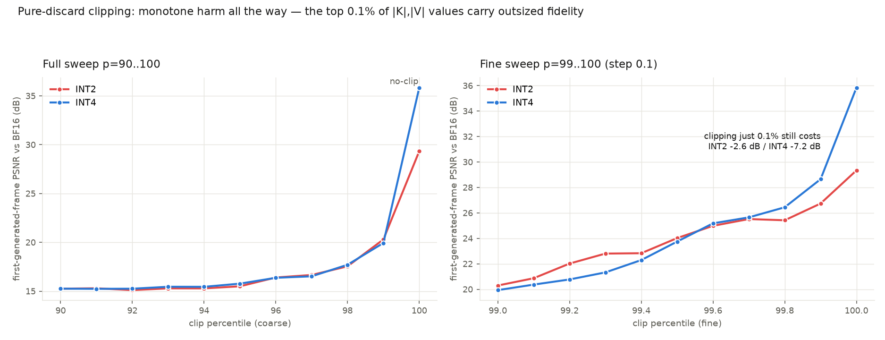

# Clip 研究：给 INT2/INT4 KV 量化加离群值裁剪有用吗？

> 问题（用户假设）：INT2 的 absmax 分块量化里，一个离群值就撑爆整块 scale——裁掉离群值应该能救回其余 99% 的分辨率？
> 本文档记录**已测变体（下称"全局纯丢弃"）**的完整结果。⚠️ 该变体的实现语义（见下框）与提出者预期的 clipping 设计不一致——结果仅对该语义有效，其他 clipping 变体（如逐块分位、残差层裁剪、提取式旁路）另行实验。

## ⚠️ 已测变体的精确语义（先读这个框）

| 维度 | 本轮实现 |
|---|---|
| 裁剪位置 | 量化入口处、**k-means 之前**，作用在原始 K/V 上 |
| 阈值粒度 | **每层每张量一个全局标量**：整层 1.21 亿元素 \|x\| 排序取第 p 分位 |
| 裁剪动作 | `clamp(x, ±t)` **硬夹、纯丢弃**——超出部分不存储、不加回、不重缩放 |
| 之后的管线 | 完全不变（kmeans 256 质心 → 减质心 → 64 块 absmax INT2/INT4） |
| 压缩率 | 与 no-clip 完全相同 |
| 实现 | `repro/clip_launcher.py`（monkeypatch `compress_kv_cache`，含 k-means RNG 隔离） |

**该变体的结论**：在所有阈值下严格有害、无最优裁剪点；\|K\|,\|V\| 最极端的千分位尾部携带不成比例的保真度信息。

## 实验设计

- **变体 B（纯丢弃）**：量化前对每层 K/V 整体做 `clamp(x, ±t)`，t = |x| 的 p 分位（`repro/clip_launcher.py`，复用仓库的 `compute_percentile_by_sorting`）。**不存离群残差、不加回**——压缩率与 no-clip 完全一致，质量变化全部归因于裁剪本身。
- 扫描 p ∈ {90, 91, …, 99, 100}（p=100 = 不裁剪，对照组）× {INT2, INT4}，载体 = LongCat seg1（QVG 主配置 S=1/B=64/K=256），k-means RNG 隔离保证 22 条 run 严格可比。
- **评测 = 首个生成帧 PSNR vs BF16**（起点窗口协议：量化误差刚注入、未被自回归混沌放大的纯净信号）。
- 全部在集群 1-GPU pod 上执行（workflow 编排，每点一个 agent 端到端负责 + 独立验证 agent 复算抽查）。

## 结果

| p 分位 | 90 | 91 | 92 | 93 | 94 | 95 | 96 | 97 | 98 | 99 | **100(不裁)** |
|---|---|---|---|---|---|---|---|---|---|---|---|
| INT2 | 15.25 | 15.29 | 15.10 | 15.29 | 15.28 | 15.50 | 16.40 | 16.66 | 17.54 | 20.29 | **29.34** |
| INT4 | 15.25 | 15.24 | 15.25 | 15.45 | 15.44 | 15.77 | 16.37 | 16.52 | 17.70 | 19.93 | **35.84**† |

†INT4 p100 对照补跑实测 35.84；早前同配置 rngiso run 为 33.54——±2 dB 波动源于 Triton atomic_add 质心更新的非确定性（EXPERIMENTS §4 已记录），扫描内部（同批 launcher）自洽。

**精扫补充（p=99..100，步长 0.1，18 条新 run）**：

| p | 99.0 | 99.1 | 99.2 | 99.3 | 99.4 | 99.5 | 99.6 | 99.7 | 99.8 | 99.9 | 100 |
|---|---|---|---|---|---|---|---|---|---|---|---|
| INT2 | 20.29 | 20.87 | 22.02 | 22.80 | 22.83 | 24.02 | 24.98 | 25.52 | 25.42 | 26.74 | 29.34 |
| INT4 | 19.93 | 20.37 | 20.77 | 21.32 | 22.29 | 23.75 | 25.18 | 25.65 | 26.44 | 28.65 | 35.84 |

精扫读数：过渡是平滑单调的、无任何平台或峰——**哪怕只裁 0.1% 的值（p99.9），INT2 仍损失 2.6 dB、INT4 损失 7.2 dB**。越接近 100 曲线越陡（尤其 INT4 最后一步 28.6→35.8）：说明保真度信息高度集中在 |K|,|V| 分布最极端的千分位尾部，且位宽越高（自身量化误差越小）对丢失尾部越敏感。这把"离群值是信号"的结论定量化到了千分位级别，也进一步支持"提取式稀疏旁路"（保住尾部而非裁掉）才是正确的利用方向。

三个读数：
1. **单调有害，无内部峰值**：PSNR 在 p=100 处最大。哪怕只裁 1%（p99），INT2 也损失 **9 dB**（20.3 vs 29.3）；p≤95 后砸穿到 ~15 dB 的混沌地板（输出已是"另一个视频"）。
2. **INT2 与 INT4 曲线在 p90-99 几乎重合**（差 <0.3 dB）——说明该区间裁剪误差完全支配量化位宽误差：破坏来自"丢了离群值"，与量化精度无关。
3. 独立验证 agent 复算抽查通过、p100 对照组与已知基线一致。

## 解释：为什么裁剪是灾难

KV cache 的离群值**不是噪声，是信号**：K 的离群通道决定哪些 token 能拿到高注意力分数，V 的大值承载主要内容贡献——裁掉它们直接改写注意力的语义（这与 LLM KV 量化文献的共识一致：outlier 通道/token 恰恰是最重要的）。QVG 的 k-means 减质心本来就是对离群值**更聪明的处理**：大值 token 聚成自己的簇、由质心精确表达，而不是被裁掉。

## 与"提取式 clip"的对照（张量级 pilot，`repro/clip_pilot.py`）

仓库自带（但从未启用）的 clip 变体是**提取式**：离群值单独存 bf16、反量化时加回。张量级 A/B 显示它确实单调降误差（INT2 rel-err 0.149 → 0.135@p99 → 0.092@p90），但代价是离群残差**稠密存储 = 一份全尺寸 bf16 拷贝**，压缩率归零——这解释了作者为何写了三份 clip 实现却全都没上线。

**可行的折中（未来方向）**：p99 提取式 + **稀疏存储**（1% 离群值，每个约 2B 值 + 4B 索引 ≈ 0.06B/值，远低于 INT2 本身的 0.25B/值预算）——即 KVQuant 式的 outlier isolation。预计可拿到 pilot 显示的 ~10% 误差改善而基本不伤压缩率，值得实现真 kernel 验证。

## 对原假设的回答（限本变体）

"加 clipping 让 INT2 KV 更好"——对**全局纯丢弃**变体：否。absmax 不裁剪虽然"浪费"分辨率在离群值上，但保住它们比精细分辨普通值重要一个数量级。若要利用离群值结构，方向是**提取+稀疏旁路**，不是丢弃。

## 状态与后续

- 本轮共 40 条生成 run（粗扫 22 + 精扫 18），全部数据/日志/视频落盘：`repro/backup/metrics/`、`repro/backup/logs/clip_*`、`results/clipstudy/`。
- **提出者已标注：本变体不是其预期的 clipping 设计**——预期设计待明确后另开实验（候选差异维度：阈值粒度〔逐块 vs 全局〕、裁剪位置〔残差层 vs 原始 KV〕、裁剪动作〔夹到阈值 vs 提取旁路〕）。本文档结论不外推到那些变体。
